# Coach

[](https://github.com/NervanaSystems/coach/blob/master/LICENSE)
[](https://nervanasystems.github.io/coach/)
[](https://doi.org/10.5281/zenodo.1134898)

<p align="center">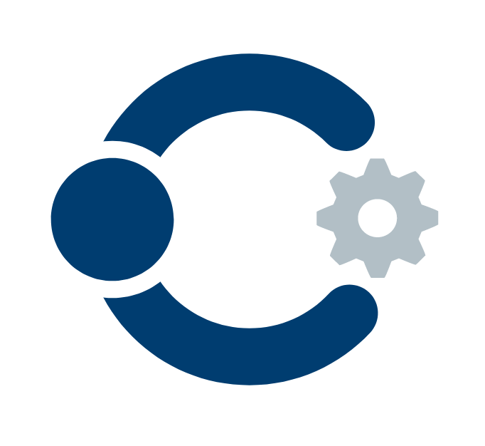</p>

Coach is a python reinforcement learning framework containing implementation of many state-of-the-art algorithms.

It exposes a set of easy-to-use APIs for experimenting with new RL algorithms, and allows simple integration of new environments to solve. 
Basic RL components (algorithms, environments, neural network architectures, exploration policies, ...) are well decoupled, so that extending and reusing existing components is fairly painless.

Training an agent to solve an environment is as easy as running:

```bash
coach -p CartPole_DQN -r
```

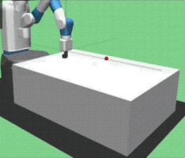 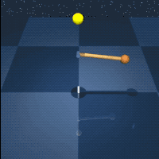 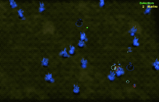
<br>
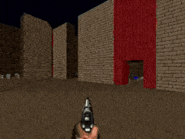 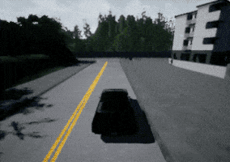 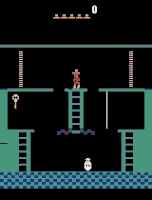
<br>
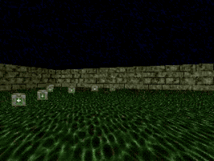 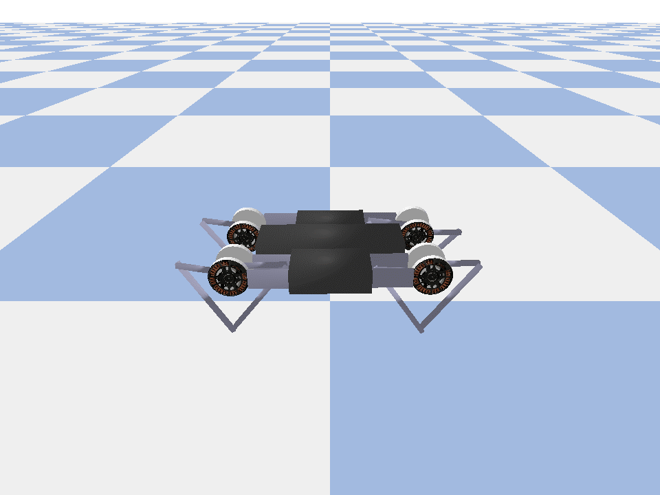 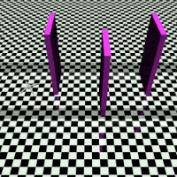
<br><br>

Blog posts from the Intel® AI website:
* [Release 0.8.0](https://ai.intel.com/reinforcement-learning-coach-intel/) (initial release)
* [Release 0.9.0](https://ai.intel.com/reinforcement-learning-coach-carla-qr-dqn/)
* [Release 0.10.0](https://ai.intel.com/introducing-reinforcement-learning-coach-0-10-0/)
* Release 0.11 (current release)

Contacting the Coach development team is also possible through the email [coach@intel.com](coach@intel.com)

## Table of Contents

- [Coach](#coach)
  * [Overview](#overview)
  * [Benchmarks](#benchmarks)
  * [Documentation](#documentation)
  * [Installation](#installation)
  * [Usage](#usage)
    + [Running Coach](#running-coach)
    + [Running Coach Dashboard (Visualization)](#running-coach-dashboard-visualization)
  * [Supported Environments](#supported-environments)
  * [Supported Algorithms](#supported-algorithms)
  * [Citation](#citation)
  * [Disclaimer](#disclaimer)

## Benchmarks

One of the main challenges when building a research project, or a solution based on a published algorithm, is getting a concrete and reliable baseline that reproduces the algorithm's results, as reported by its authors. To address this problem, we are releasing a set of [benchmarks](benchmarks) that shows Coach reliably reproduces many state of the art algorithm results.

## Documentation

Framework documentation, algorithm description and instructions on how to contribute a new agent/environment can be found [here](https://nervanasystems.github.io/coach/).


## Installation

Note: Coach has only been tested on Ubuntu 16.04 LTS, and with Python 3.5.

For some information on installing on Ubuntu 17.10 with Python 3.6.3, please refer to the following issue: https://github.com/NervanaSystems/coach/issues/54

In order to install coach, there are a few prerequisites required. This will setup all the basics needed to get the user going with running Coach on top of [OpenAI Gym](https://github.com/openai/gym) environments:

```
# General
sudo -E apt-get install python3-pip cmake zlib1g-dev python3-tk python-opencv -y

# Boost libraries
sudo -E apt-get install libboost-all-dev -y

# Scipy requirements
sudo -E apt-get install libblas-dev liblapack-dev libatlas-base-dev gfortran -y

# PyGame
sudo -E apt-get install libsdl-dev libsdl-image1.2-dev libsdl-mixer1.2-dev libsdl-ttf2.0-dev
libsmpeg-dev libportmidi-dev libavformat-dev libswscale-dev -y

# Dashboard
sudo -E apt-get install dpkg-dev build-essential python3.5-dev libjpeg-dev  libtiff-dev libsdl1.2-dev libnotify-dev 
freeglut3 freeglut3-dev libsm-dev libgtk2.0-dev libgtk-3-dev libwebkitgtk-dev libgtk-3-dev libwebkitgtk-3.0-dev
libgstreamer-plugins-base1.0-dev -y

# Gym
sudo -E apt-get install libav-tools libsdl2-dev swig cmake -y
```

We recommend installing coach in a virtualenv:

```
sudo -E pip3 install virtualenv
virtualenv -p python3 coach_env
. coach_env/bin/activate
```

Finally, install coach using pip:
```
pip3 install rl_coach
```

Or alternatively, for a development environment, install coach from the cloned repository:
```
cd coach
pip3 install -e .
```

If a GPU is present, Coach's pip package will install tensorflow-gpu, by default. If a GPU is not present, an [Intel-Optimized TensorFlow](https://software.intel.com/en-us/articles/intel-optimized-tensorflow-wheel-now-available), will be installed. 

In addition to OpenAI Gym, several other environments were tested and are supported. Please follow the instructions in the Supported Environments section below in order to install more environments.

## Usage

### Running Coach

To allow reproducing results in Coach, we defined a mechanism called _preset_. 
There are several available presets under the `presets` directory.
To list all the available presets use the `-l` flag.

To run a preset, use:

```bash
coach -r -p <preset_name>
```

For example:
* CartPole environment using Policy Gradients (PG):

  ```bash
  coach -r -p CartPole_PG
  ```
  
* Basic level of Doom using Dueling network and Double DQN (DDQN) algorithm:

  ```bash
  coach -r -p Doom_Basic_Dueling_DDQN
  ```

Some presets apply to a group of environment levels, like the entire Atari or Mujoco suites for example.
To use these presets, the requeseted level should be defined using the `-lvl` flag.

For example:


* Pong using the Nerual Episodic Control (NEC) algorithm:

  ```bash
  coach -r -p Atari_NEC -lvl pong
  ```

There are several types of agents that can benefit from running them in a distributed fashion with multiple workers in parallel. Each worker interacts with its own copy of the environment but updates a shared network, which improves the data collection speed and the stability of the learning process.
To specify the number of workers to run, use the `-n` flag.

For example:
* Breakout using Asynchronous Advantage Actor-Critic (A3C) with 8 workers:

  ```bash
  coach -r -p Atari_A3C -lvl breakout -n 8
  ```


It is easy to create new presets for different levels or environments by following the same pattern as in presets.py

More usage examples can be found [here](https://nervanasystems.github.io/coach/usage/index.html).

### Distributed Multi-Node Coach

As of release 0.11 Coach supports horizontal scaling for training RL agents on multiple nodes. In release 0.11 this was tested on the ClippedPPO and DQN agents.
For usage instructions please refer to the documentation [here](https://nervanasystems.github.io/coach/dist_usage.html)

### Running Coach Dashboard (Visualization)
Training an agent to solve an environment can be tricky, at times. 

In order to debug the training process, Coach outputs several signals, per trained algorithm, in order to track algorithmic performance. 

While Coach trains an agent, a csv file containing the relevant training signals will be saved to the 'experiments' directory. Coach's dashboard can then be used to dynamically visualize the training signals, and track algorithmic behavior. 

To use it, run:

```bash
dashboard
```


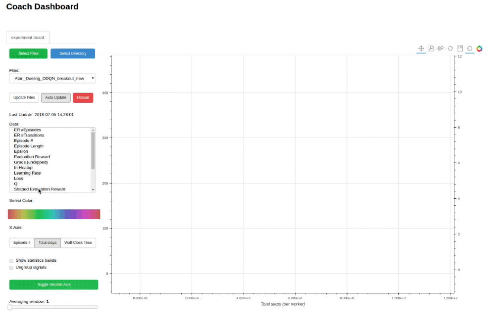


## Supported Environments

* *OpenAI Gym:*

    Installed by default by Coach's installer

* *ViZDoom:*

    Follow the instructions described in the ViZDoom repository -

    https://github.com/mwydmuch/ViZDoom

    Additionally, Coach assumes that the environment variable VIZDOOM_ROOT points to the ViZDoom installation directory.

* *Roboschool:*

    Follow the instructions described in the roboschool repository - 

    https://github.com/openai/roboschool

* *GymExtensions:*

    Follow the instructions described in the GymExtensions repository -

    https://github.com/Breakend/gym-extensions

    Additionally, add the installation directory to the PYTHONPATH environment variable.

* *PyBullet:*

    Follow the instructions described in the [Quick Start Guide](https://docs.google.com/document/d/10sXEhzFRSnvFcl3XxNGhnD4N2SedqwdAvK3dsihxVUA) (basically just - 'pip install pybullet')

* *CARLA:*

    Download release 0.8.4 from the CARLA repository -

    https://github.com/carla-simulator/carla/releases

    Create a new CARLA_ROOT environment variable pointing to CARLA's installation directory.

    A simple CARLA settings file (```CarlaSettings.ini```) is supplied with Coach, and is located in the ```environments``` directory.

* *Starcraft:*

    Follow the instructions described in the PySC2 repository - 
    
    https://github.com/deepmind/pysc2
    
* *DeepMind Control Suite:*

    Follow the instructions described in the DeepMind Control Suite repository - 
    
    https://github.com/deepmind/dm_control


## Supported Algorithms

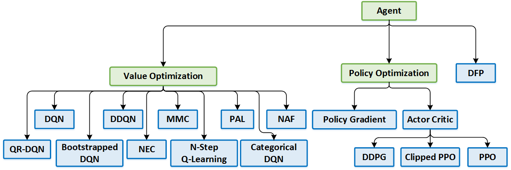


### Value Optimization Agents
* [Deep Q Network (DQN)](https://www.cs.toronto.edu/~vmnih/docs/dqn.pdf)  ([code](rl_coach/agents/dqn_agent.py))
* [Double Deep Q Network (DDQN)](https://arxiv.org/pdf/1509.06461.pdf)  ([code](rl_coach/agents/ddqn_agent.py))
* [Dueling Q Network](https://arxiv.org/abs/1511.06581)
* [Mixed Monte Carlo (MMC)](https://arxiv.org/abs/1703.01310)  ([code](rl_coach/agents/mmc_agent.py))
* [Persistent Advantage Learning (PAL)](https://arxiv.org/abs/1512.04860)  ([code](rl_coach/agents/pal_agent.py))
* [Categorical Deep Q Network (C51)](https://arxiv.org/abs/1707.06887)  ([code](rl_coach/agents/categorical_dqn_agent.py))
* [Quantile Regression Deep Q Network (QR-DQN)](https://arxiv.org/pdf/1710.10044v1.pdf)  ([code](rl_coach/agents/qr_dqn_agent.py))
* [N-Step Q Learning](https://arxiv.org/abs/1602.01783) | **Multi Worker Single Node**  ([code](rl_coach/agents/n_step_q_agent.py))
* [Neural Episodic Control (NEC)](https://arxiv.org/abs/1703.01988)  ([code](rl_coach/agents/nec_agent.py))
* [Normalized Advantage Functions (NAF)](https://arxiv.org/abs/1603.00748.pdf) | **Multi Worker Single Node**  ([code](rl_coach/agents/naf_agent.py))
* [Rainbow](https://arxiv.org/abs/1710.02298)  ([code](rl_coach/agents/rainbow_dqn_agent.py))

### Policy Optimization Agents
* [Policy Gradients (PG)](http://www-anw.cs.umass.edu/~barto/courses/cs687/williams92simple.pdf) | **Multi Worker Single Node**  ([code](rl_coach/agents/policy_gradients_agent.py))
* [Asynchronous Advantage Actor-Critic (A3C)](https://arxiv.org/abs/1602.01783) | **Multi Worker Single Node**  ([code](rl_coach/agents/actor_critic_agent.py))
* [Deep Deterministic Policy Gradients (DDPG)](https://arxiv.org/abs/1509.02971) | **Multi Worker Single Node**  ([code](rl_coach/agents/ddpg_agent.py))
* [Proximal Policy Optimization (PPO)](https://arxiv.org/pdf/1707.06347.pdf)  ([code](rl_coach/agents/ppo_agent.py))
* [Clipped Proximal Policy Optimization (CPPO)](https://arxiv.org/pdf/1707.06347.pdf) | **Multi Worker Single Node**  ([code](rl_coach/agents/clipped_ppo_agent.py))
* [Generalized Advantage Estimation (GAE)](https://arxiv.org/abs/1506.02438) ([code](rl_coach/agents/actor_critic_agent.py#L86))

### General Agents
* [Direct Future Prediction (DFP)](https://arxiv.org/abs/1611.01779) | **Multi Worker Single Node**  ([code](rl_coach/agents/dfp_agent.py))

### Imitation Learning Agents
* Behavioral Cloning (BC)  ([code](rl_coach/agents/bc_agent.py))
* [Conditional Imitation Learning](https://arxiv.org/abs/1710.02410) ([code](rl_coach/agents/cil_agent.py))

### Hierarchical Reinforcement Learning Agents
* [Hierarchical Actor Critic (HAC)](https://arxiv.org/abs/1712.00948.pdf) ([code](rl_coach/agents/ddpg_hac_agent.py))

### Memory Types
* [Hindsight Experience Replay (HER)](https://arxiv.org/abs/1707.01495.pdf) ([code](rl_coach/memories/episodic/episodic_hindsight_experience_replay.py))
* [Prioritized Experience Replay (PER)](https://arxiv.org/abs/1511.05952) ([code](rl_coach/memories/non_episodic/prioritized_experience_replay.py))

### Exploration Techniques
* E-Greedy ([code](rl_coach/exploration_policies/e_greedy.py))
* Boltzmann ([code](rl_coach/exploration_policies/boltzmann.py))
* Ornstein–Uhlenbeck process ([code](rl_coach/exploration_policies/ou_process.py))
* Normal Noise ([code](rl_coach/exploration_policies/additive_noise.py))
* Truncated Normal Noise ([code](rl_coach/exploration_policies/truncated_normal.py))
* [Bootstrapped Deep Q Network](https://arxiv.org/abs/1602.04621)  ([code](rl_coach/agents/bootstrapped_dqn_agent.py))
* [UCB Exploration via Q-Ensembles (UCB)](https://arxiv.org/abs/1706.01502) ([code](rl_coach/exploration_policies/ucb.py))
* [Noisy Networks for Exploration](https://arxiv.org/abs/1706.10295) ([code](rl_coach/exploration_policies/parameter_noise.py))

## Citation

If you used Coach for your work, please use the following citation:

```
@misc{caspi_itai_2017_1134899,
  author       = {Caspi, Itai and
                  Leibovich, Gal and
                  Novik, Gal and
                  Endrawis, Shadi},
  title        = {Reinforcement Learning Coach},
  month        = dec,
  year         = 2017,
  doi          = {10.5281/zenodo.1134899},
  url          = {https://doi.org/10.5281/zenodo.1134899}
}
```

## Disclaimer

Coach is released as a reference code for research purposes. It is not an official Intel product, and the level of quality and support may not be as expected from an official product. 
Additional algorithms and environments are planned to be added to the framework. Feedback and contributions from the open source and RL research communities are more than welcome.
