# Coach Benchmarks

The following figures are training curves of some of the presets available through Coach.
The X axis in all the figures is the total steps (for multi-threaded runs, this is the accumulated number of steps over all the workers).
The Y axis in all the figures is the average episode reward with an averaging window of 11 episodes.
These are the result you can expect to get when running the pre-defined presets in Coach.


## A3C

### Breakout_A3C with 16 workers

```bash
python3 coach.py -p Breakout_A3C -n 16 -r
```

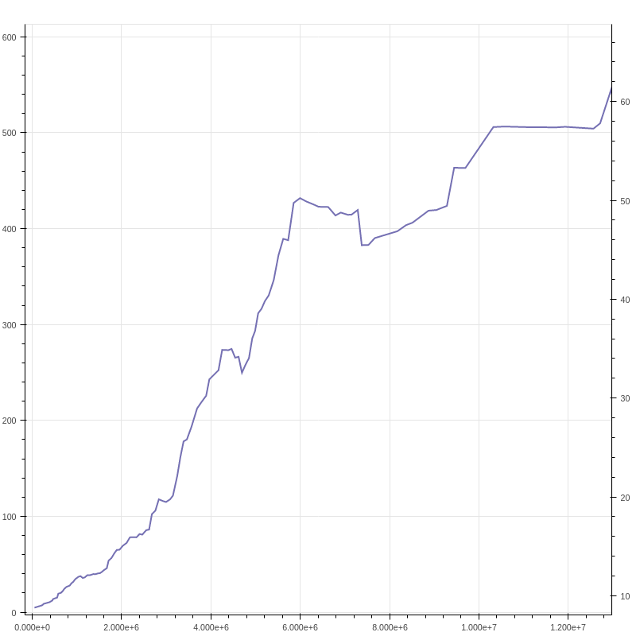

### InvertedPendulum_A3C with 16 workers

```bash
python3 coach.py -p InvertedPendulum_A3C -n 16 -r
```

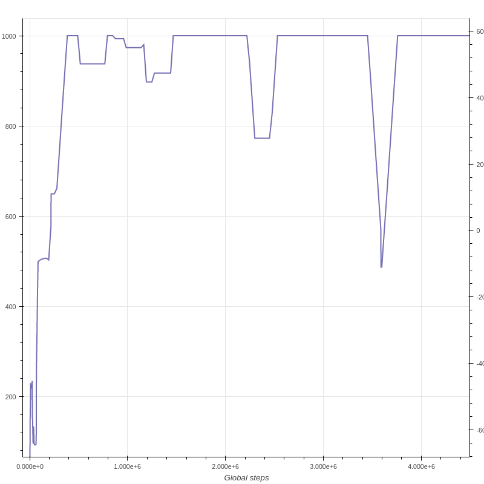

### Hopper_A3C with 16 workers

```bash
python3 coach.py -p Hopper_A3C -n 16 -r
```

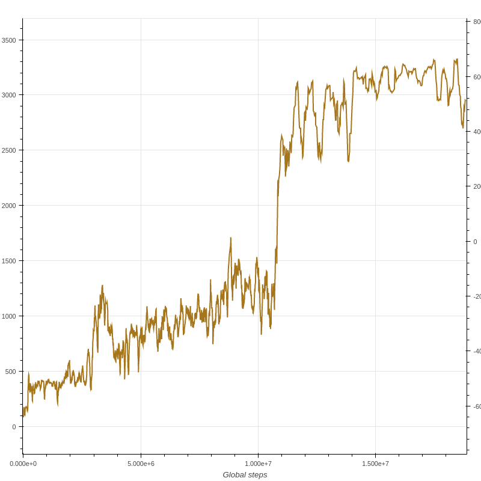

### Ant_A3C with 16 workers

```bash
python3 coach.py -p Ant_A3C -n 16 -r
```

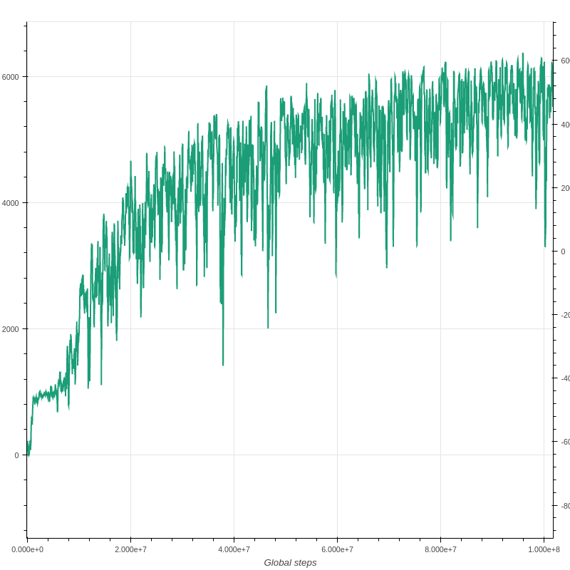

## Clipped PPO

### InvertedPendulum_ClippedPPO with 16 workers

```bash
python3 coach.py -p InvertedPendulum_ClippedPPO -n 16 -r
```

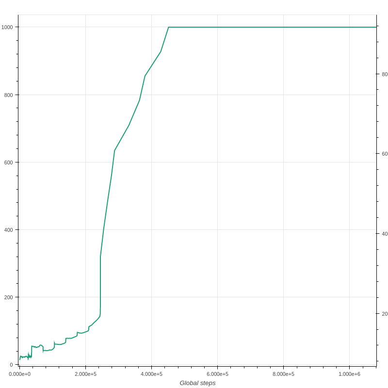

### Hopper_ClippedPPO with 16 workers

```bash
python3 coach.py -p Hopper_ClippedPPO -n 16 -r
```

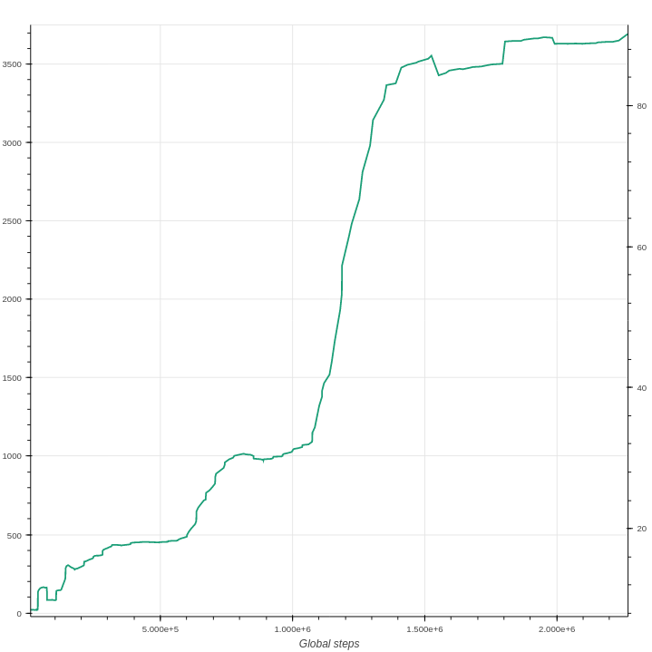

### Humanoid_ClippedPPO with 16 workers

```bash
python3 coach.py -p Humanoid_ClippedPPO -n 16 -r
```

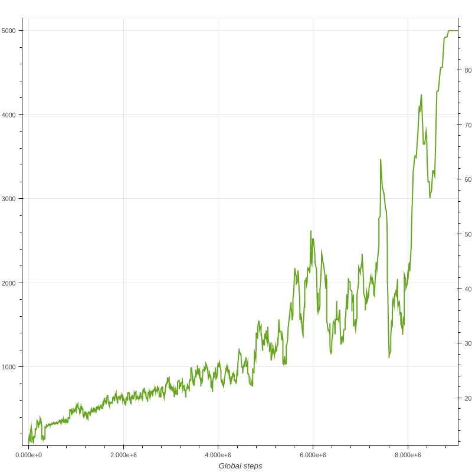

## DQN

### Pong_DQN

```bash
python3 coach.py -p Pong_DQN -r
```

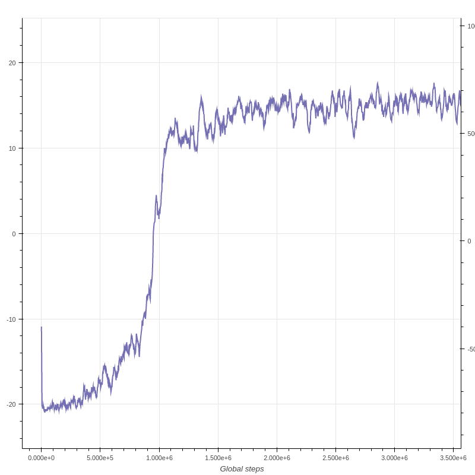

### Doom_Basic_DQN

```bash
python3 coach.py -p Doom_Basic_DQN -r
```

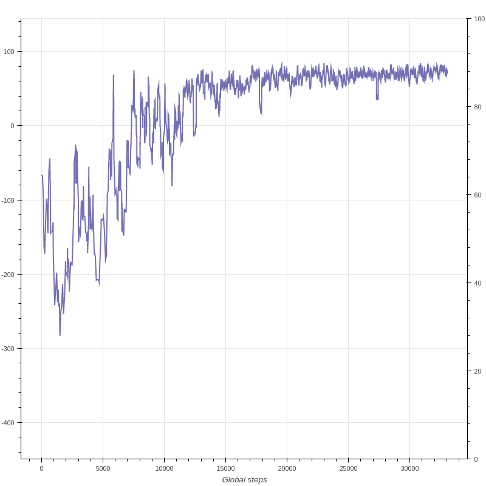

## Dueling DDQN

### Doom_Basic_Dueling_DDQN

```bash
python3 coach.py -p Doom_Basic_Dueling_DDQN -r
```

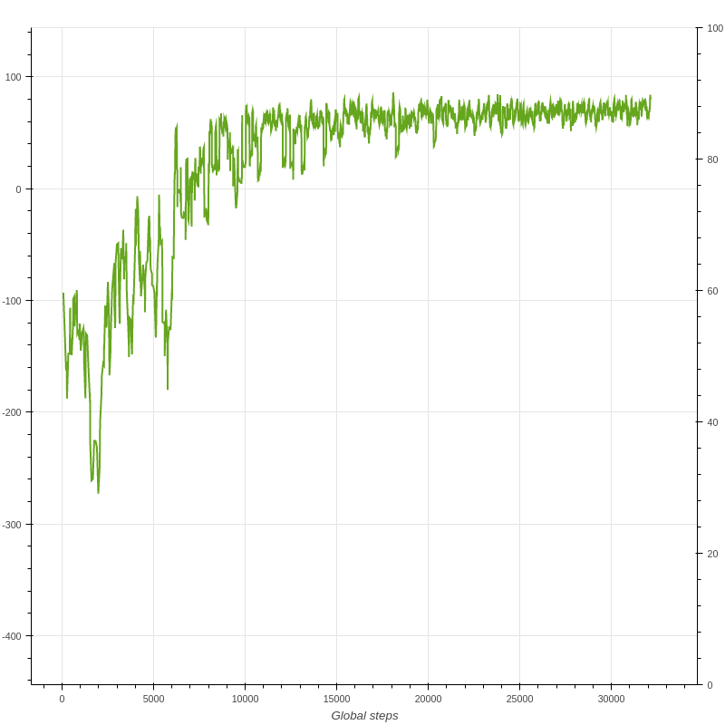

## DFP

### Doom_Health_DFP

```bash
python3 coach.py -p Doom_Health_DFP -r
```


## MMC

### Doom_Health_MMC

```bash
python3 coach.py -p Doom_Health_MMC -r
```

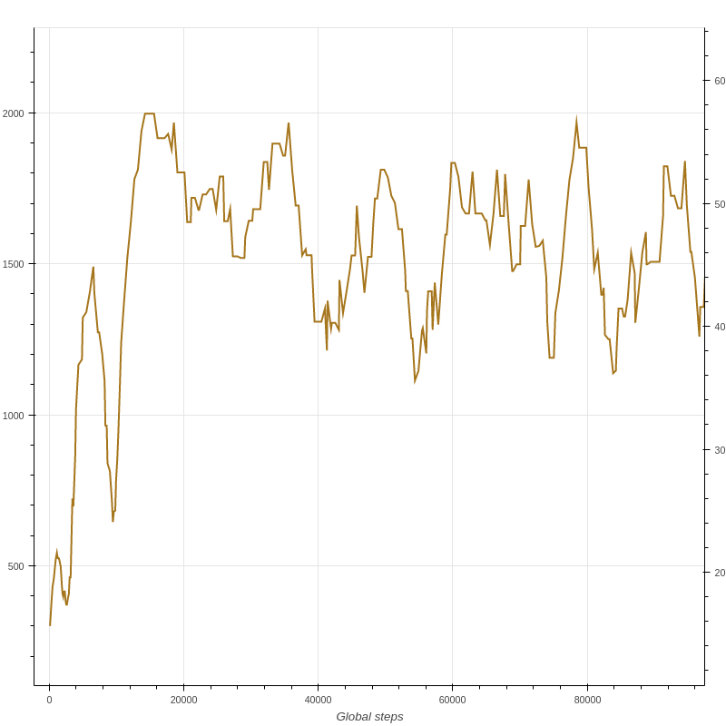

## NEC

## Doom_Basic_NEC

```bash
python3 coach.py -p Doom_Basic_NEC -r
```

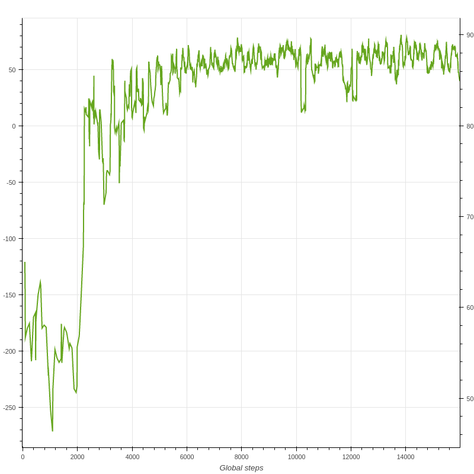

## PG

### CartPole_PG

```bash
python3 coach.py -p CartPole_PG -r
```

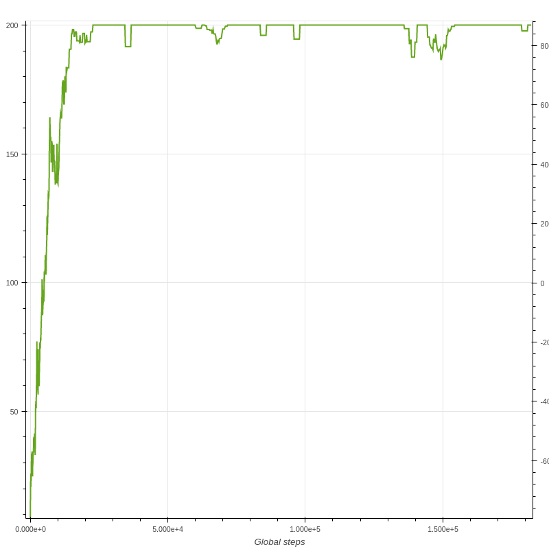

## DDPG

### Pendulum_DDPG

```bash
python3 coach.py -p Pendulum_DDPG -r
```


## NAF

### InvertedPendulum_NAF

```bash
python3 coach.py -p InvertedPendulum_NAF -r
```

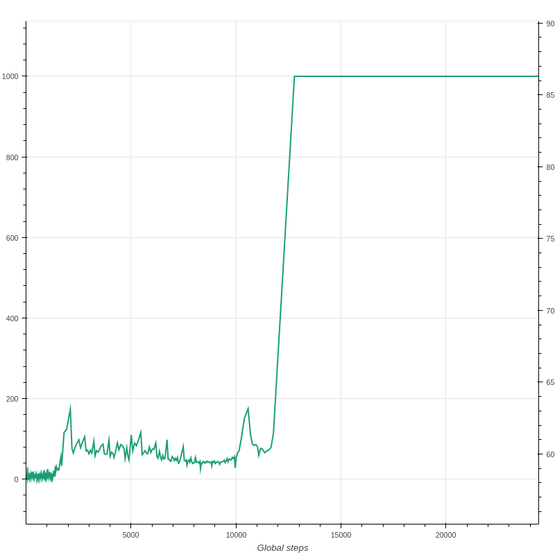

### Pendulum_NAF

```bash
python3 coach.py -p Pendulum_NAF -r
```

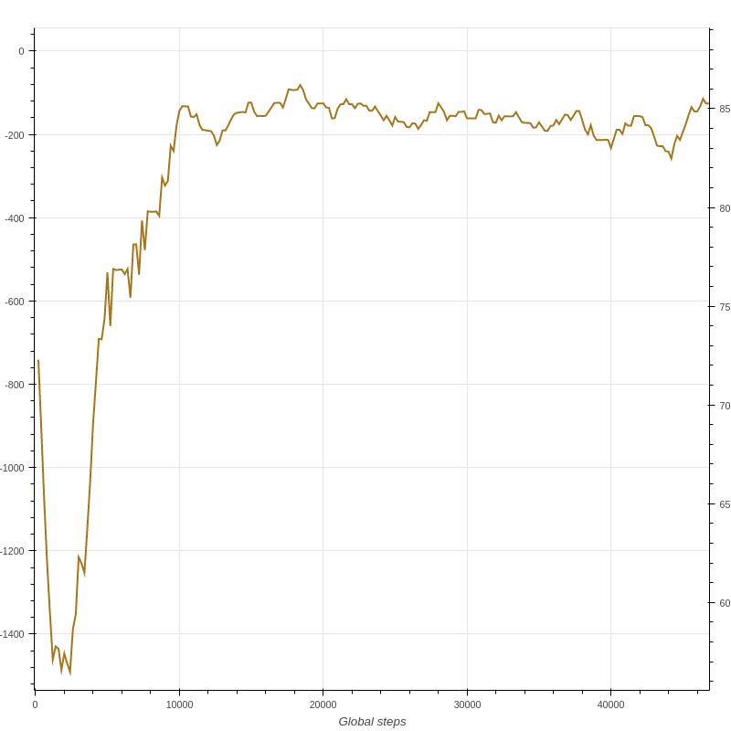
