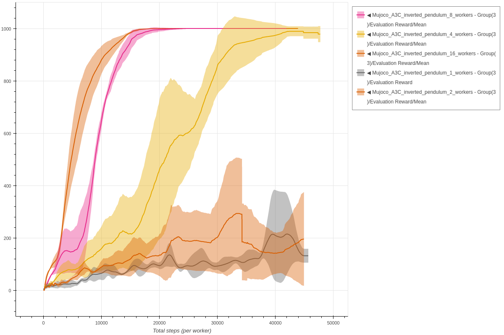
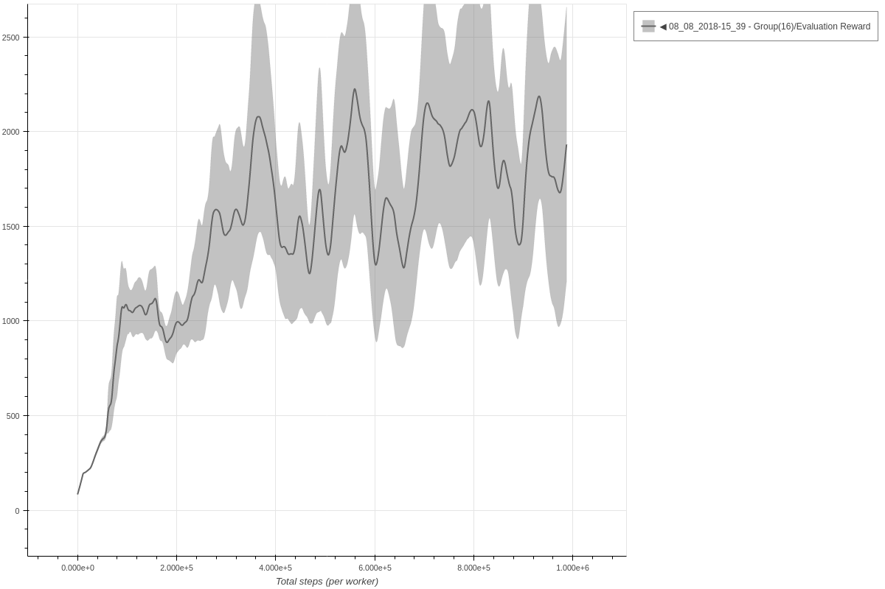
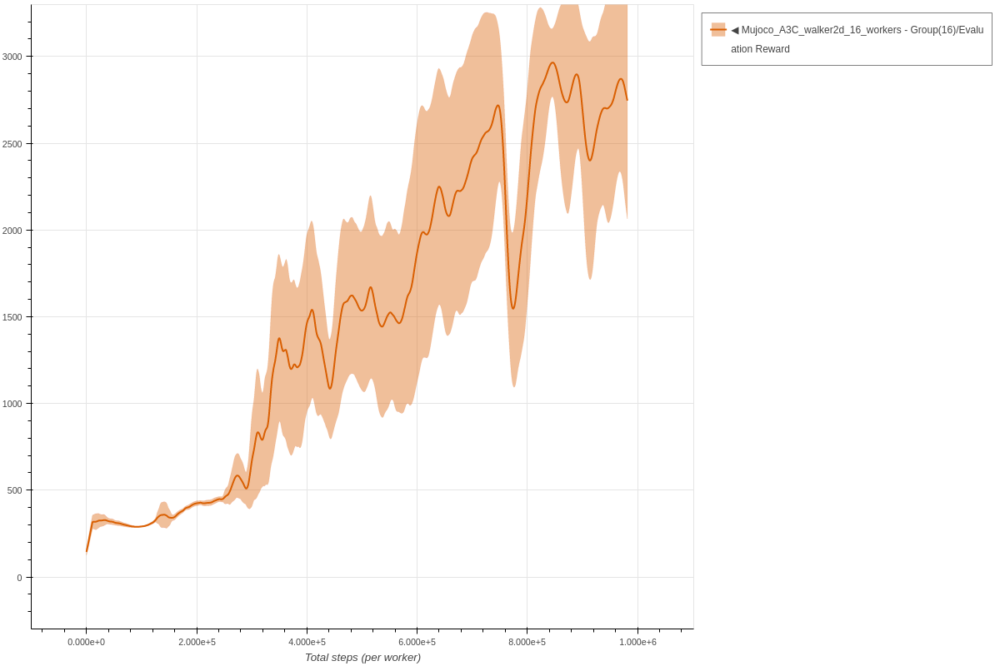
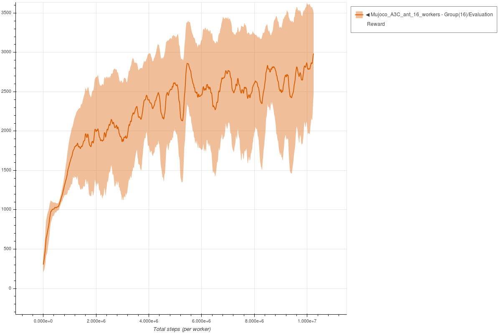
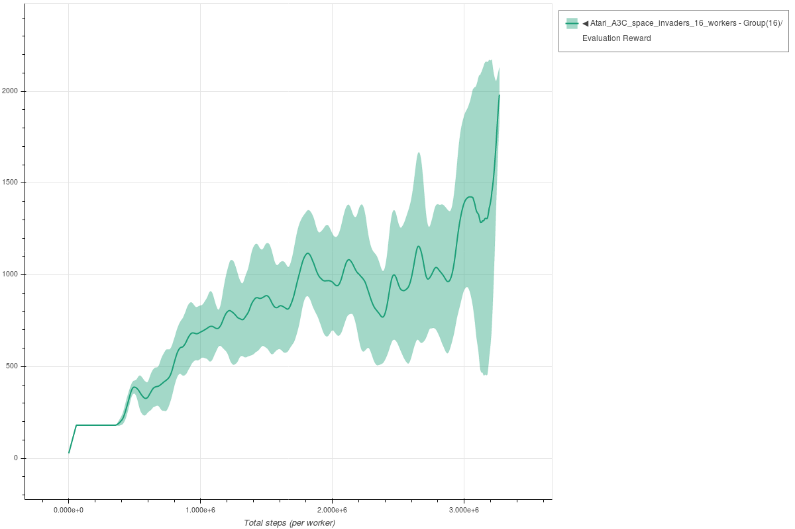

# A3C

Each experiment uses 3 seeds.
The parameters used for A3C are the same parameters as described in the [original paper](https://arxiv.org/abs/1602.01783).

### Inverted Pendulum A3C - 1/2/4/8/16 workers

```bash
coach -p Mujoco_A3C -lvl inverted_pendulum -n 1
coach -p Mujoco_A3C -lvl inverted_pendulum -n 2
coach -p Mujoco_A3C -lvl inverted_pendulum -n 4
coach -p Mujoco_A3C -lvl inverted_pendulum -n 8
coach -p Mujoco_A3C -lvl inverted_pendulum -n 16
```




### Hopper A3C - 16 workers

```bash
coach -p Mujoco_A3C -lvl hopper -n 16
```




### Walker2D A3C - 16 workers

```bash
coach -p Mujoco_A3C -lvl walker2d -n 16
```




### Half Cheetah A3C - 16 workers

```bash
coach -p Mujoco_A3C -lvl half_cheetah -n 16
```


### Ant A3C - 16 workers

```bash
coach -p Mujoco_A3C -lvl ant -n 16
```




### Space Invaders A3C - 16 workers

```bash
coach -p Atari_A3C -lvl space_invaders -n 16
```


