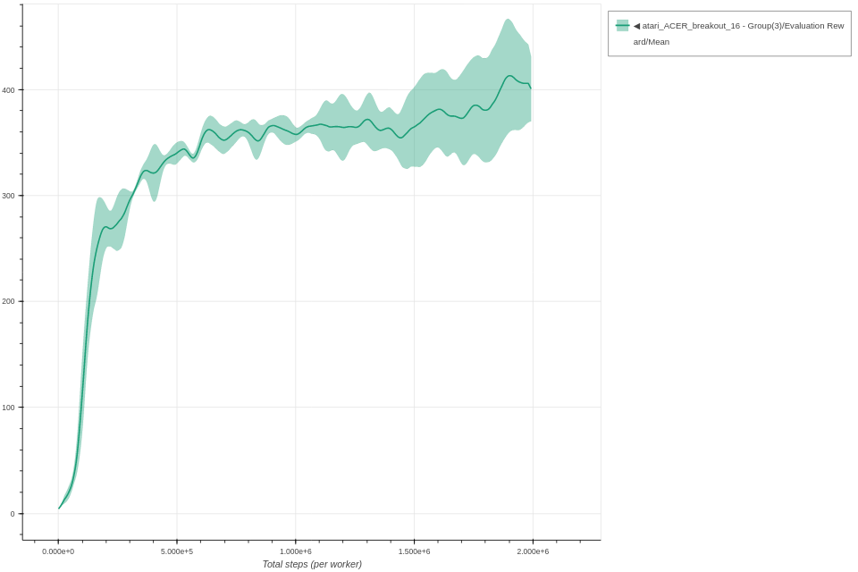

# ACER

Each experiment uses 3 seeds.
The parameters used for ACER are the same parameters as described in the [original paper](https://arxiv.org/abs/1611.01224), except for the optimizer (changed to ADAM) and learning rate (1e-4) used.

### Breakout ACER - 16 workers

```bash
coach -p Atari_ACER -lvl breakout -n 16
```



### Space Invaders ACER - 16 workers

```bash
coach -p Atari_ACER -lvl space_invaders -n 16
```


### Pong ACER - 16 workers

```bash
coach -p Atari_ACER -lvl pong -n 16
```


