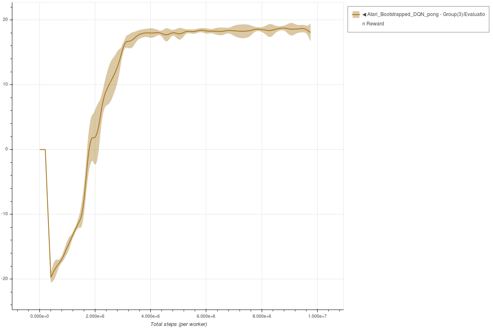
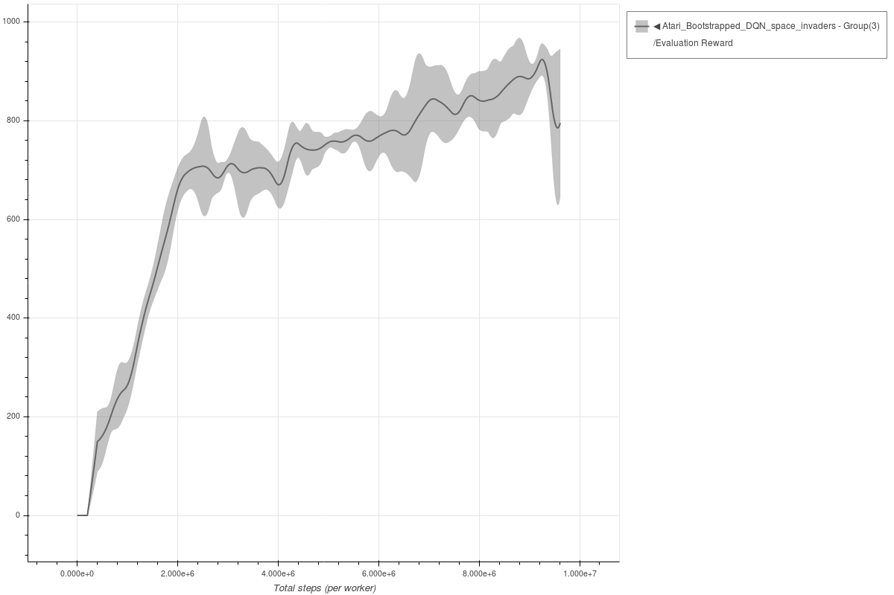

# Bootstrapped DQN

Each experiment uses 3 seeds.
The parameters used for Bootstrapped DQN are the same parameters as described in the [original paper](https://arxiv.org/abs/1602.04621.pdf).

### Breakout Bootstrapped DQN - single worker

```bash
coach -p Atari_Bootstrapped_DQN -lvl breakout
```


### Pong Bootstrapped DQN - single worker

```bash
coach -p Atari_Bootstrapped_DQN -lvl pong
```




### Space Invaders Bootstrapped DQN - single worker

```bash
coach -p Atari_Bootstrapped_DQN -lvl space_invaders
```



