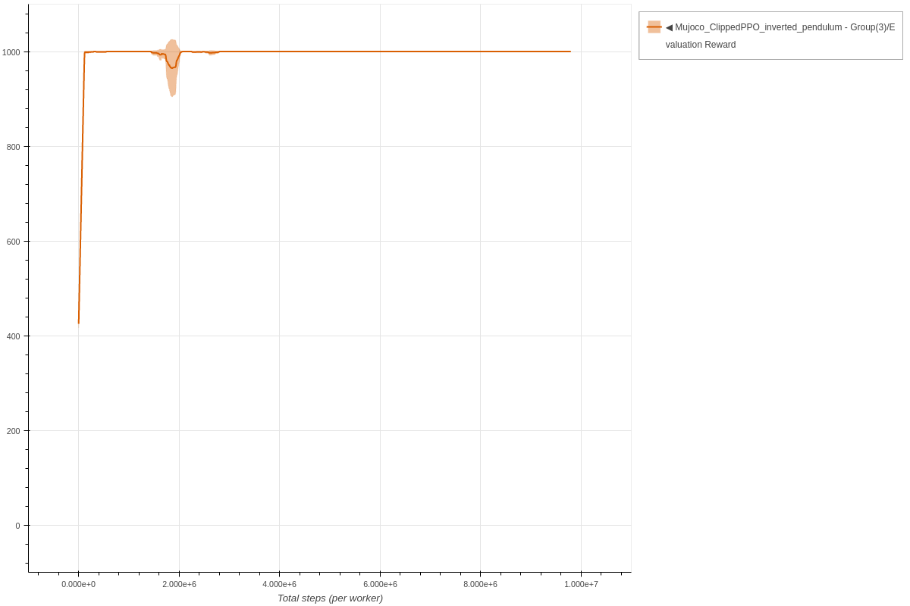
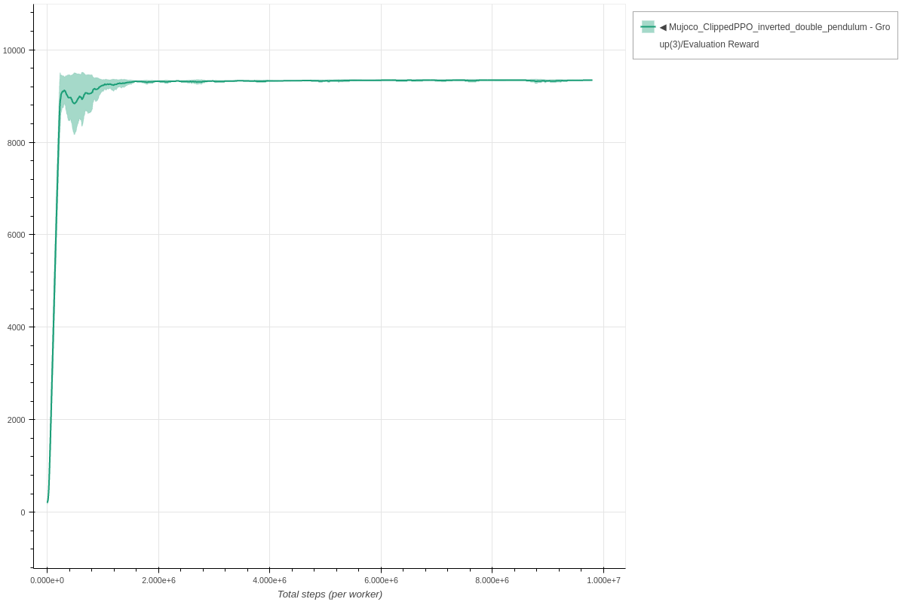
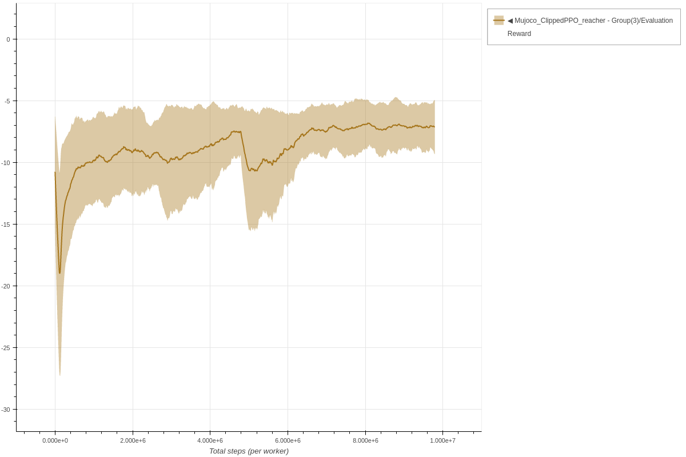
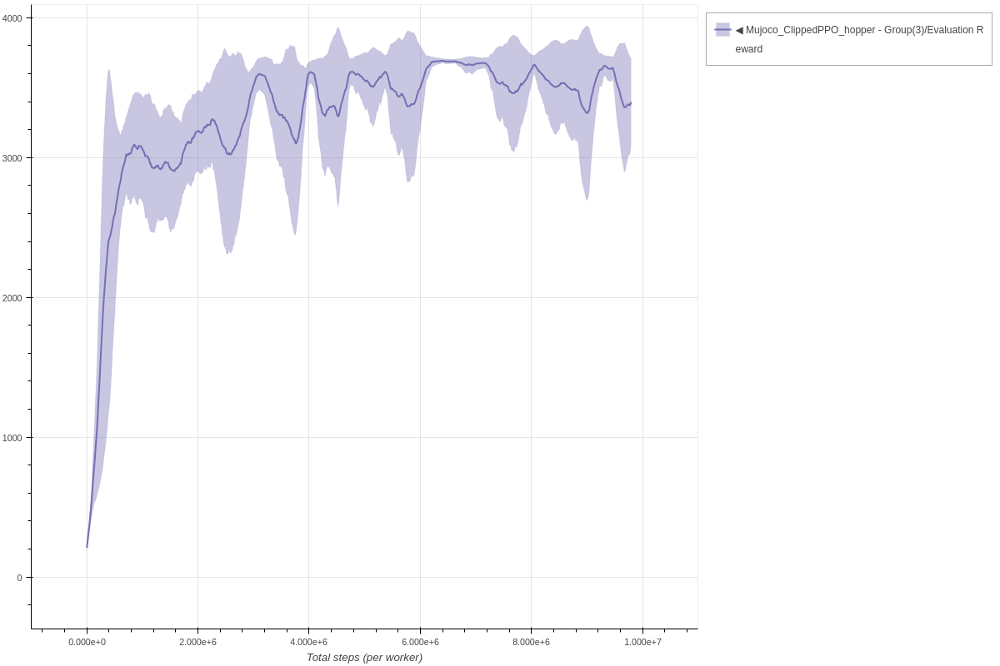
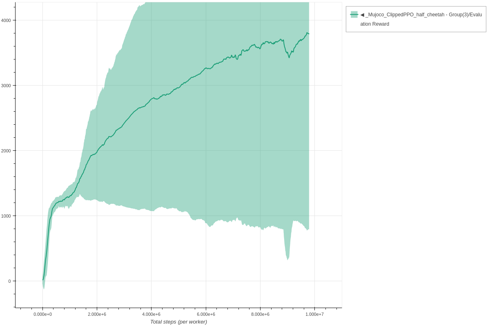
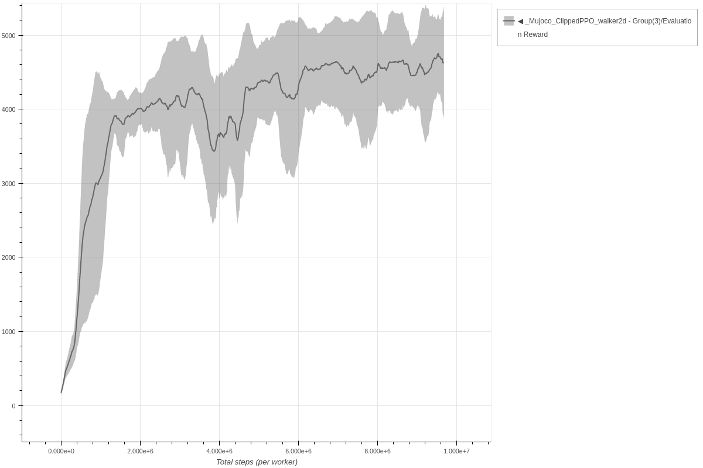
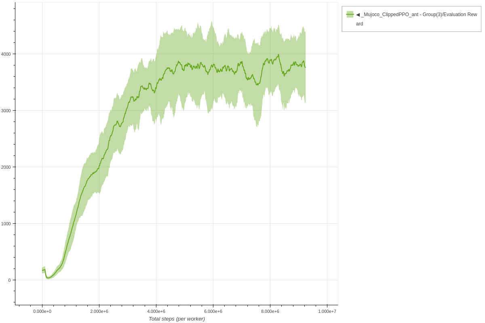
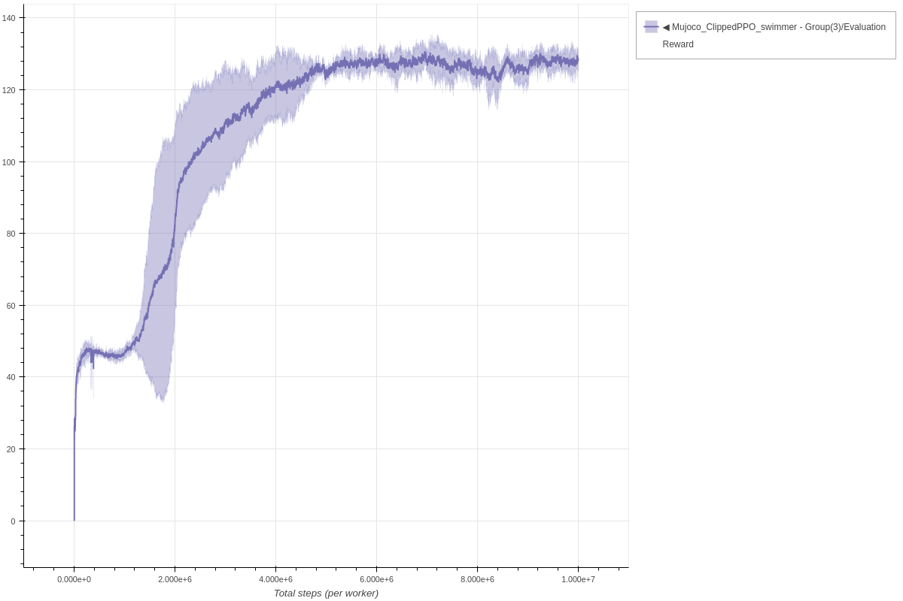
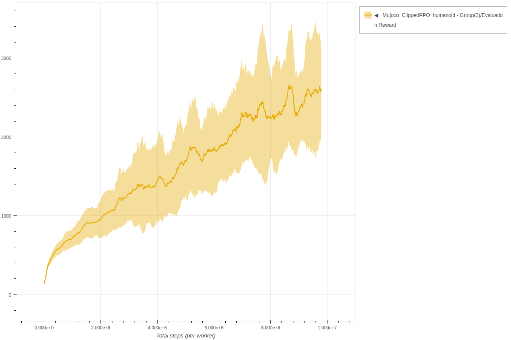

# Clipped PPO

Each experiment uses 3 seeds and is trained for 10k environment steps.
The parameters used for Clipped PPO are the same parameters as described in the [original paper](https://arxiv.org/abs/1707.06347).

### Inverted Pendulum Clipped PPO - single worker

```bash
coach -p Mujoco_ClippedPPO -lvl inverted_pendulum
```




### Inverted Double Pendulum Clipped PPO - single worker

```bash
coach -p Mujoco_ClippedPPO -lvl inverted_double_pendulum
```




### Reacher Clipped PPO - single worker

```bash
coach -p Mujoco_ClippedPPO -lvl reacher
```




### Hopper Clipped PPO - single worker

```bash
coach -p Mujoco_ClippedPPO -lvl hopper
```




### Half Cheetah Clipped PPO - single worker

```bash
coach -p Mujoco_ClippedPPO -lvl half_cheetah
```




### Walker 2D Clipped PPO - single worker

```bash
coach -p Mujoco_ClippedPPO -lvl walker2d
```




### Ant Clipped PPO - single worker

```bash
coach -p Mujoco_ClippedPPO -lvl ant
```




### Swimmer Clipped PPO - single worker

```bash
coach -p Mujoco_ClippedPPO -lvl swimmer
```




### Humanoid Clipped PPO - single worker

```bash
coach -p Mujoco_ClippedPPO -lvl humanoid
```


