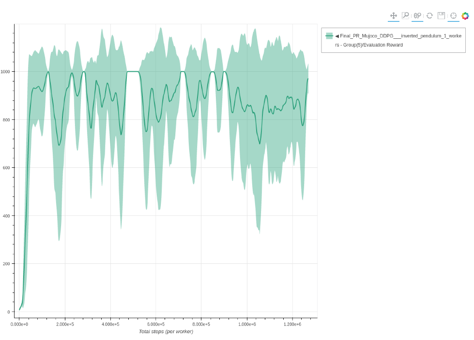
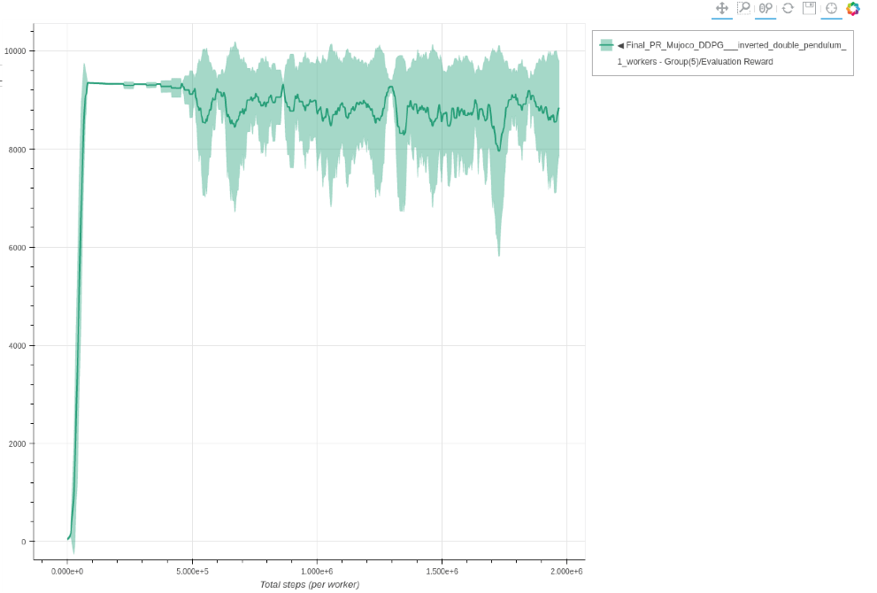
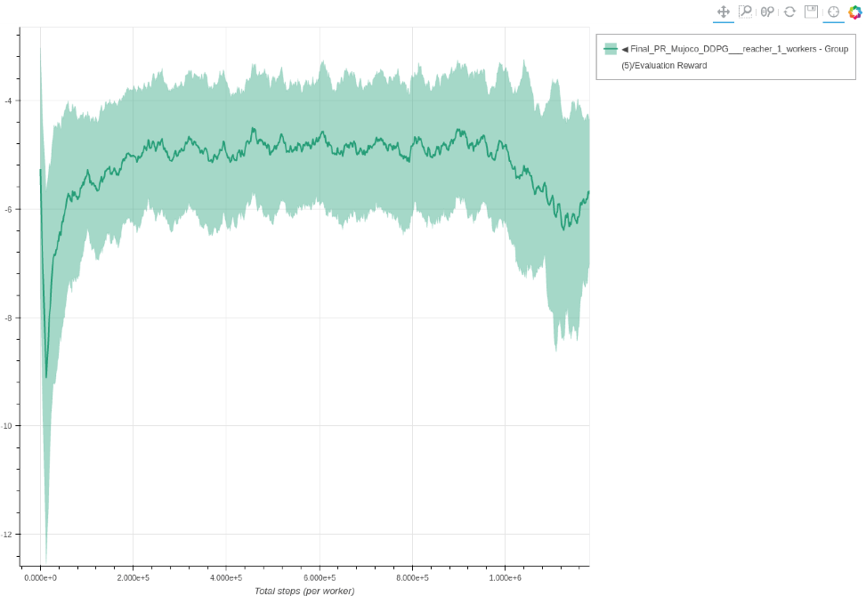
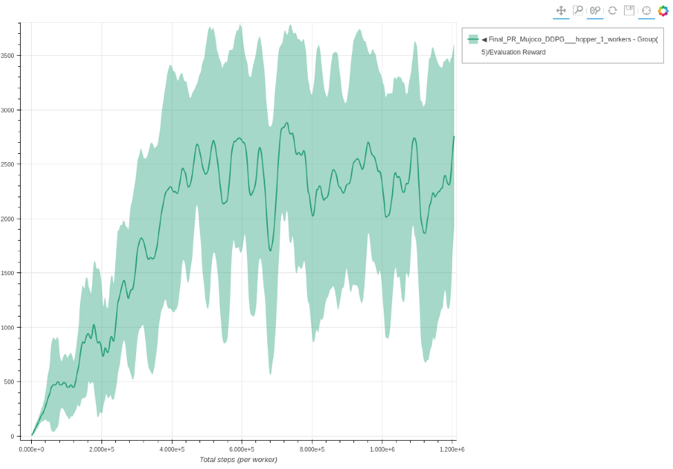
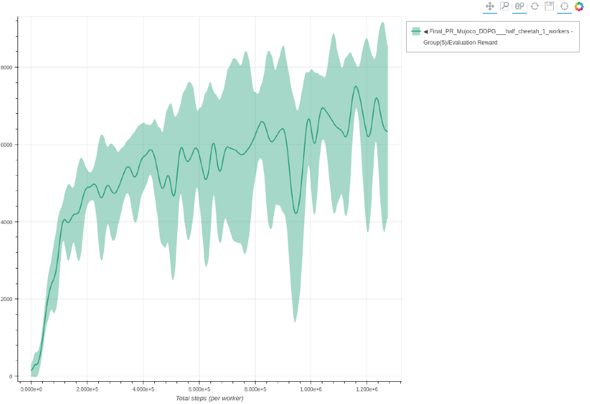
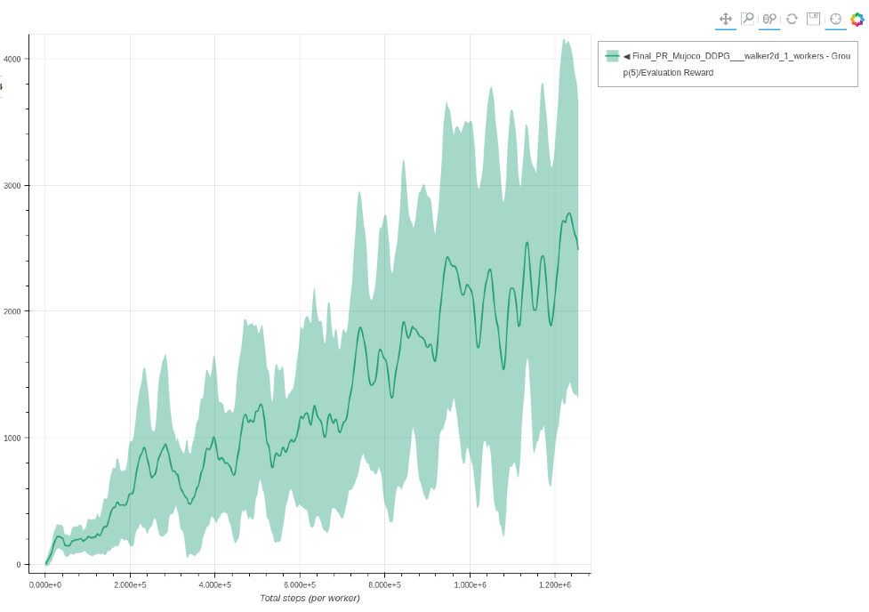
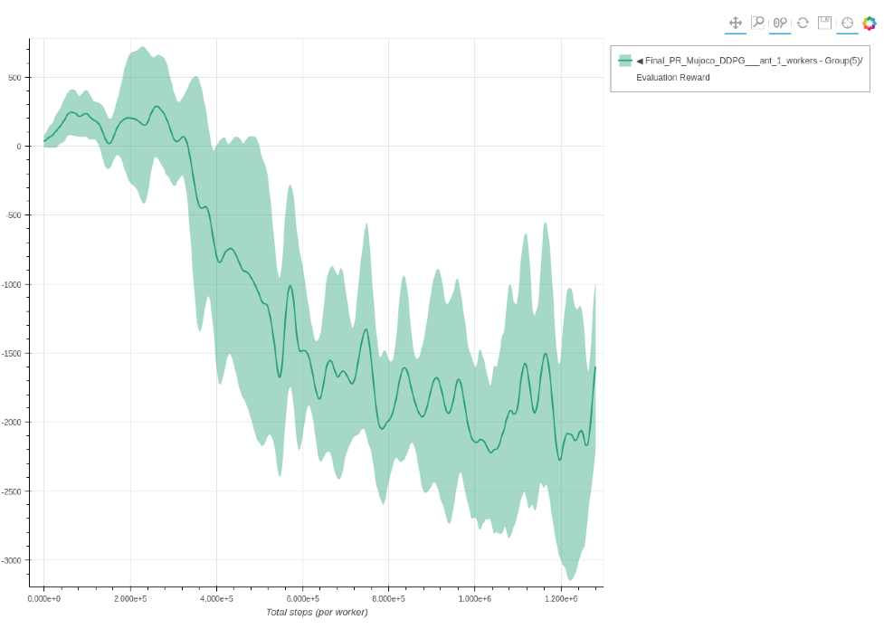
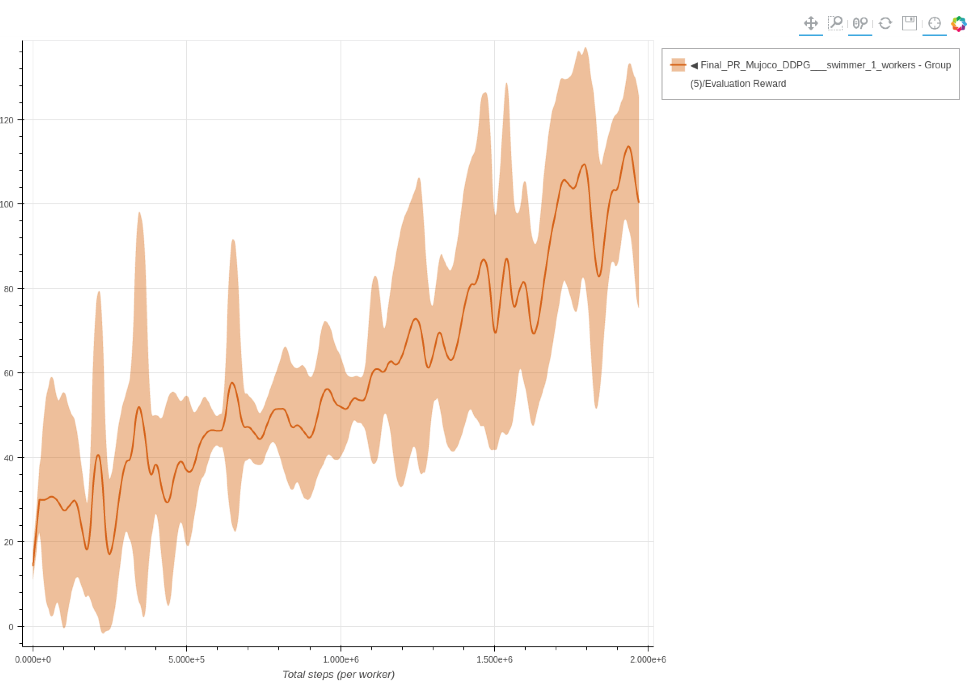
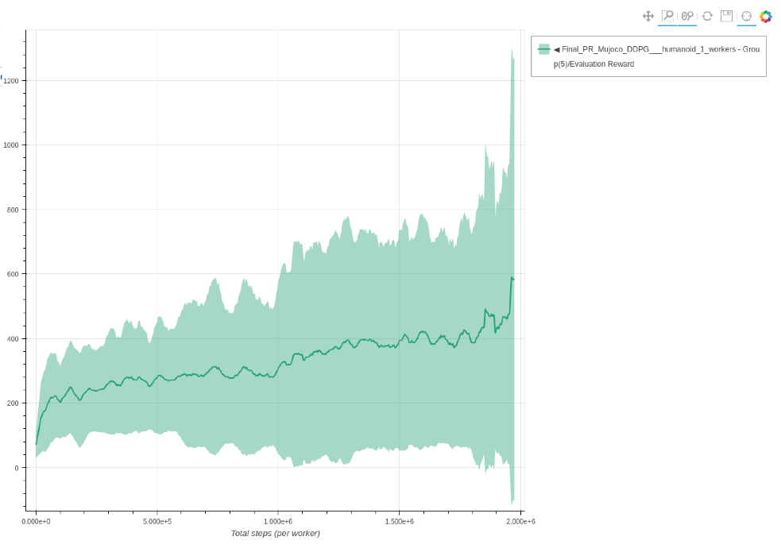

# DDPG

Each experiment uses 3 seeds and is trained for 2k environment steps.
The parameters used for DDPG are the same parameters as described in the [original paper](https://arxiv.org/abs/1509.02971).

### Inverted Pendulum DDPG - single worker

```bash
coach -p Mujoco_DDPG -lvl inverted_pendulum
```




### Inverted Double Pendulum DDPG - single worker

```bash
coach -p Mujoco_DDPG -lvl inverted_double_pendulum
```




### Reacher DDPG - single worker

```bash
coach -p Mujoco_DDPG -lvl reacher
```




### Hopper DDPG - single worker

```bash
coach -p Mujoco_DDPG -lvl hopper
```




### Half Cheetah DDPG - single worker

```bash
coach -p Mujoco_DDPG -lvl half_cheetah
```




### Walker 2D DDPG - single worker

```bash
coach -p Mujoco_DDPG -lvl walker2d
```




### Ant DDPG - single worker

```bash
coach -p Mujoco_DDPG -lvl ant
```




### Swimmer DDPG - single worker

```bash
coach -p Mujoco_DDPG -lvl swimmer
```




### Humanoid DDPG - single worker

```bash
coach -p Mujoco_DDPG -lvl humanoid
```


