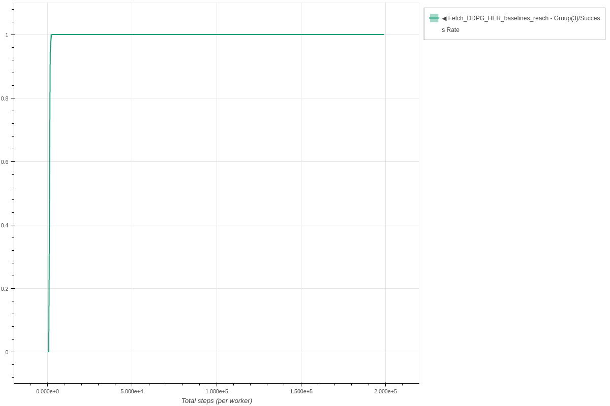
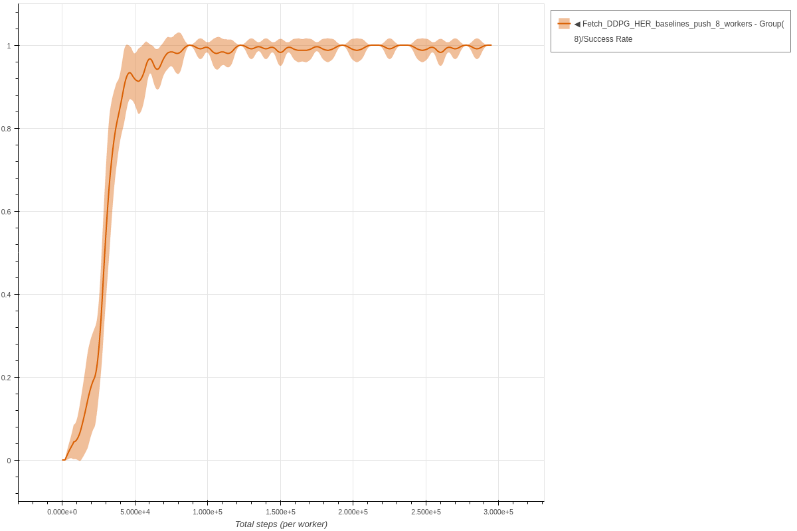
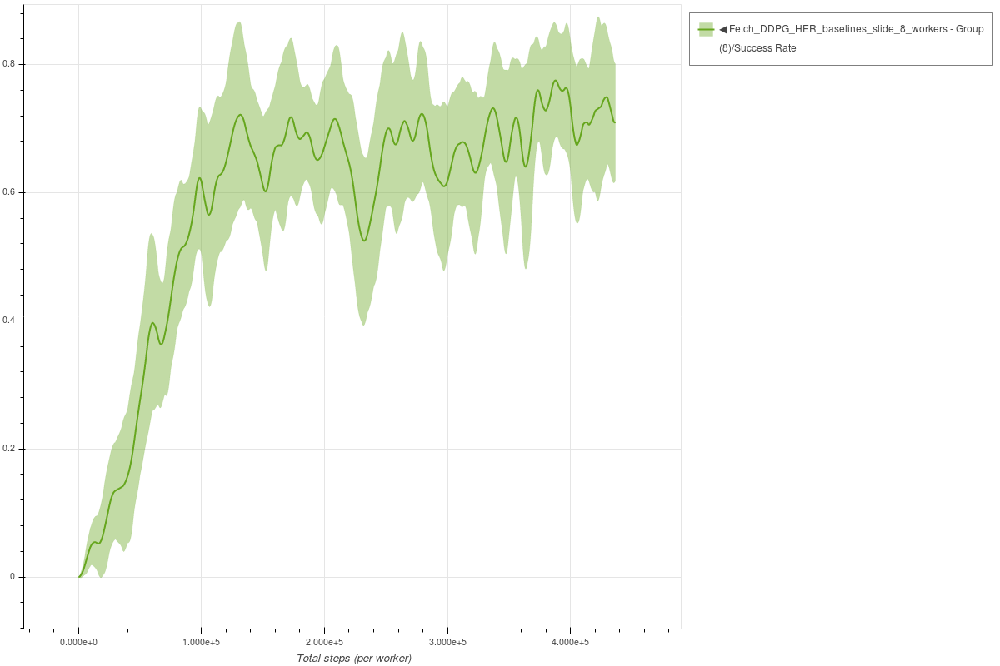

# DDPG with Hindsight Experience Replay

Each experiment uses 3 seeds.
The parameters used for DDPG HER are the same parameters as described in the [following paper](https://arxiv.org/abs/1802.09464).

### Fetch Reach DDPG HER - single worker

```bash
coach -p Fetch_DDPG_HER_baselines -lvl reach
```




### Fetch Push DDPG HER - 8 workers

```bash
coach -p Fetch_DDPG_HER_baselines -lvl push -n 8
```




### Fetch Slide DDPG HER - 8 workers

```bash
coach -p Fetch_DDPG_HER_baselines -lvl slide -n 8
```




### Fetch Pick And Place DDPG HER - 8 workers

```bash
coach -p Fetch_DDPG_HER -lvl pick_and_place -n 8
```


