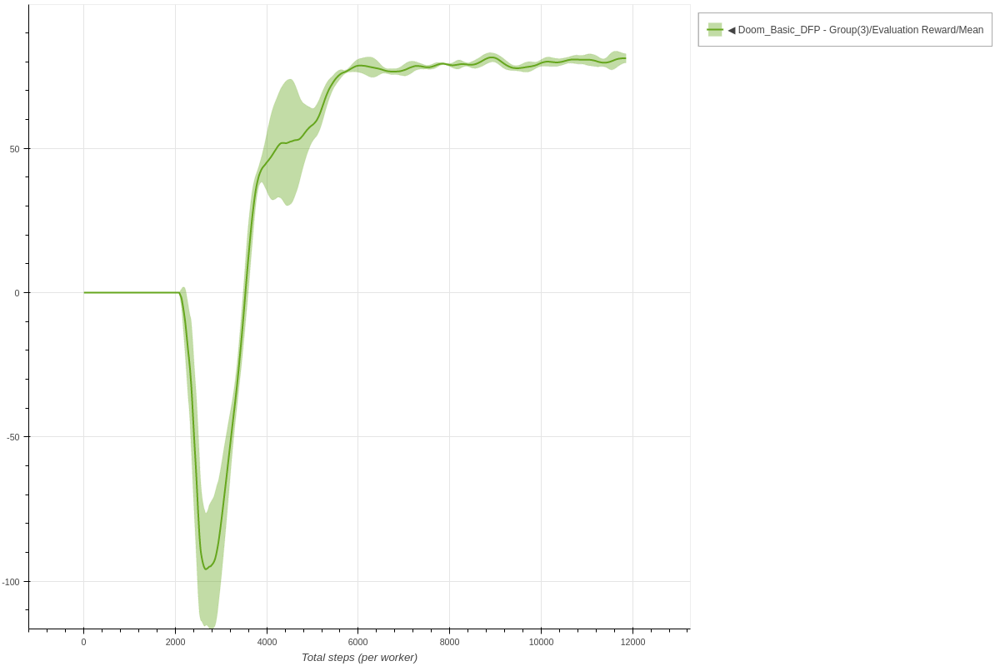
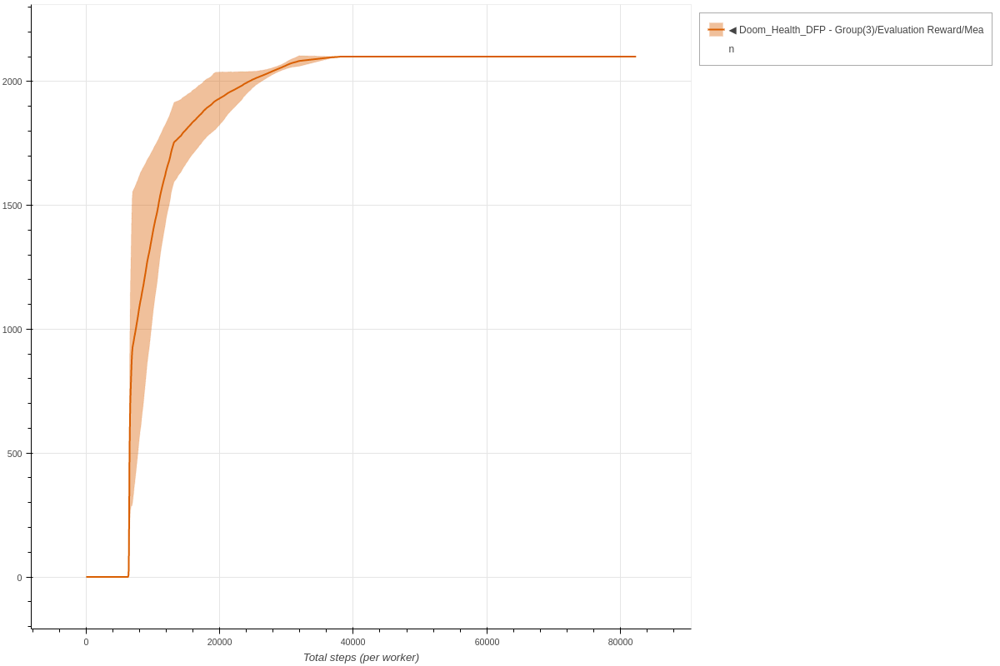
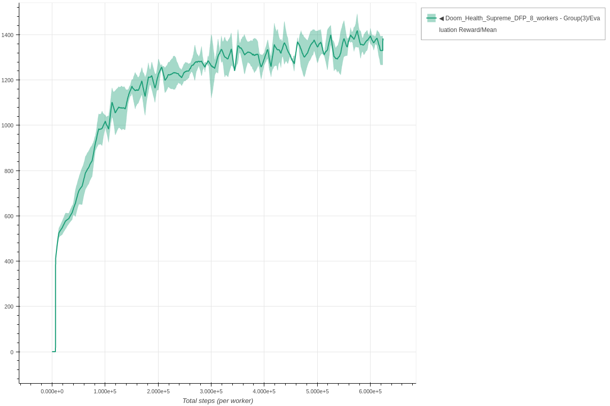

# DFP

Each experiment uses 3 seeds.
The parameters used for DFP are the same parameters as described in the [original paper](https://arxiv.org/abs/1611.01779).

### Doom Basic DFP - 8 workers

```bash
coach -p Doom_Basic_DFP -n 8
```




### Doom Health (D1: Basic) DFP - 8 workers

```bash
coach -p Doom_Health_DFP -n 8
```




### Doom Health Supreme (D2: Navigation) DFP - 8 workers

```bash
coach -p Doom_Health_Supreme_DFP -n 8
```


