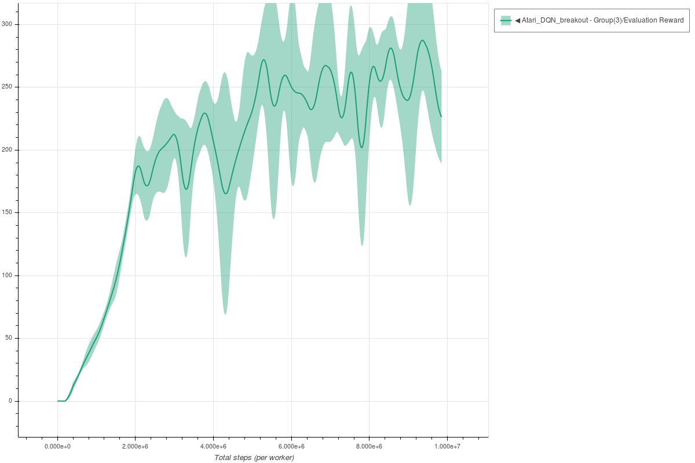
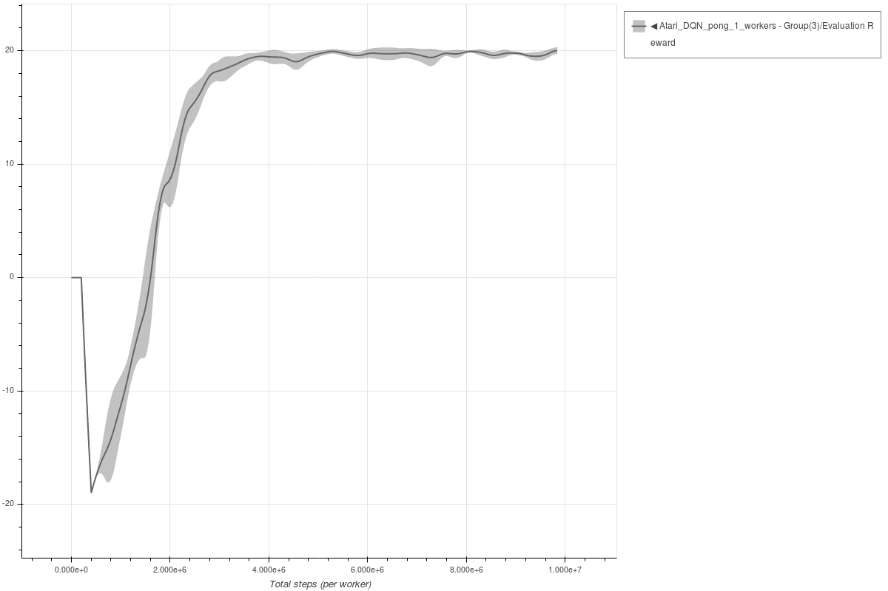
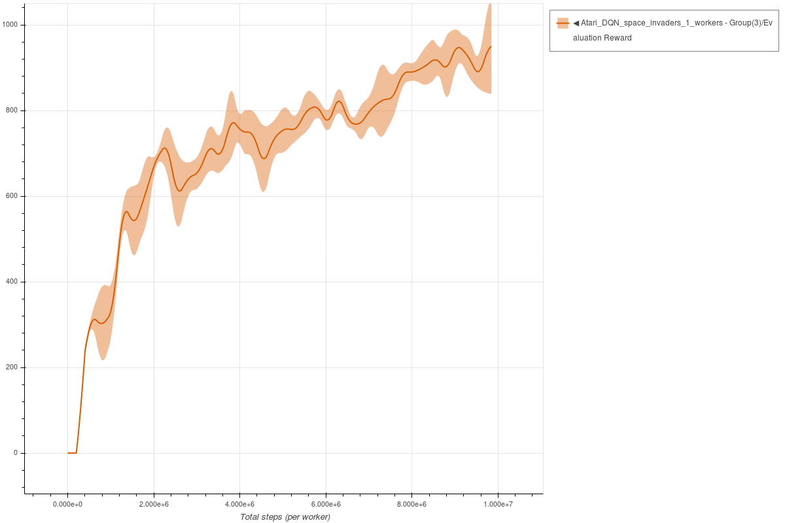

# DQN

Each experiment uses 3 seeds.
The parameters used for DQN are the same parameters as described in the [original paper](https://www.cs.toronto.edu/~vmnih/docs/dqn.pdf), except for the optimizer (changed to ADAM) and learning rate (1e-4) used.

### Breakout DQN - single worker

```bash
coach -p Atari_DQN -lvl breakout
```



### Pong DQN - single worker

```bash
coach -p Atari_DQN -lvl pong
```



### Space Invaders DQN - single worker

```bash
coach -p Atari_DQN -lvl space_invaders
```




