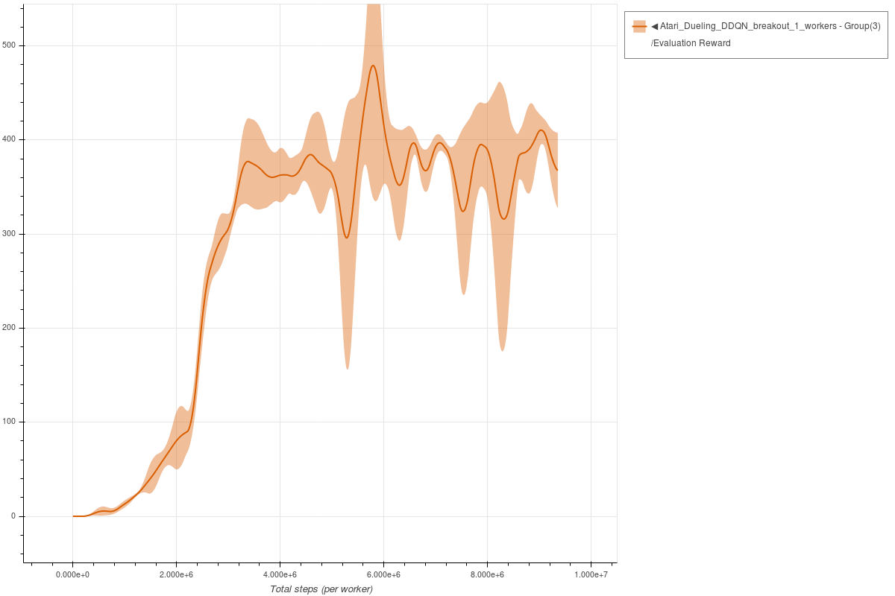

# Dueling DDQN

Each experiment uses 3 seeds and is trained for 10k environment steps.
The parameters used for Dueling DDQN are the same parameters as described in the [original paper](https://arxiv.org/abs/1706.01502).

### Breakout Dueling DDQN - single worker

```bash
python3 coach.py -p Atari_Dueling_DDQN -lvl breakout
```




