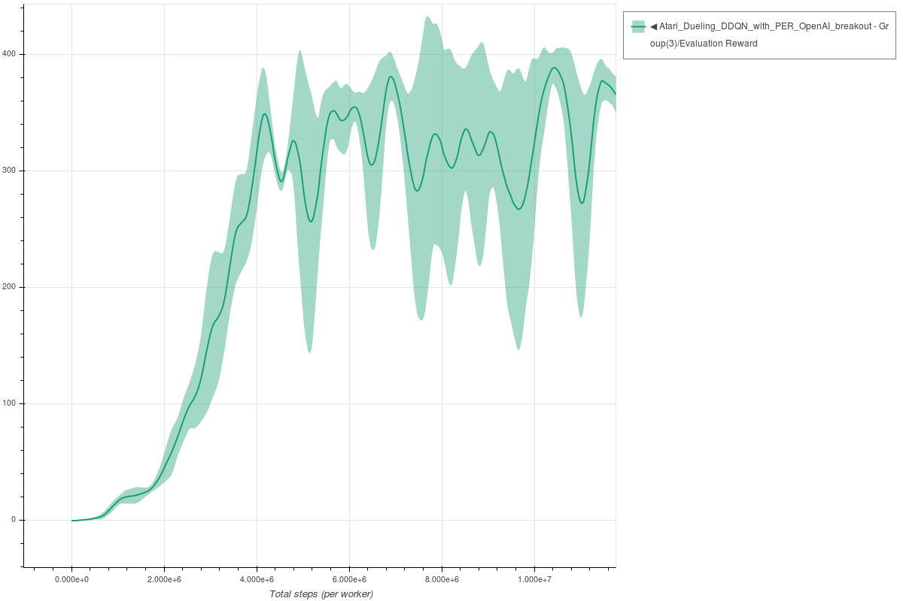
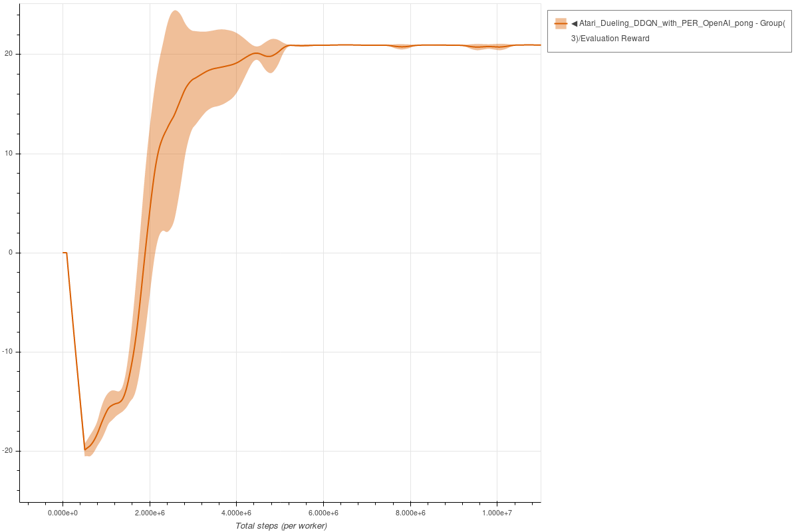
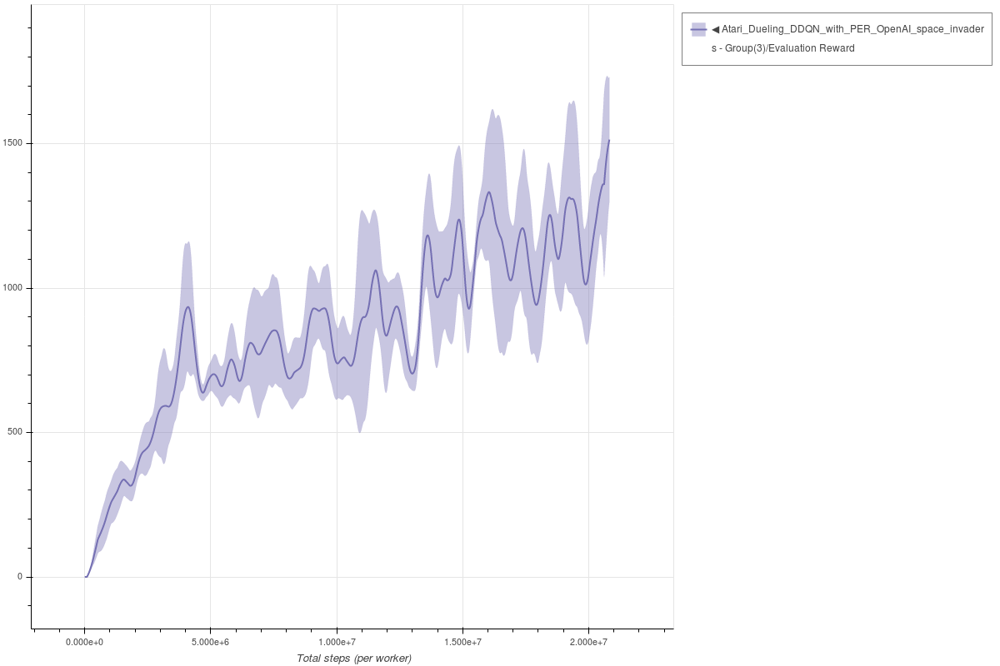

# Dueling DDQN with Prioritized Experience Replay

Each experiment uses 3 seeds and is trained for 10k environment steps.
The parameters used for Dueling DDQN with PER are the same parameters as described in the [following paper](https://arxiv.org/abs/1511.05952).

### Breakout Dueling DDQN with PER - single worker

```bash
coach -p Atari_Dueling_DDQN_with_PER_OpenAI -lvl breakout
```




### Pong Dueling DDQN with PER - single worker

```bash
coach -p Atari_Dueling_DDQN_with_PER_OpenAI -lvl pong
```




### Space Invaders Dueling DDQN with PER - single worker

```bash
coach -p Atari_Dueling_DDQN_with_PER_OpenAI -lvl space_invaders
```



