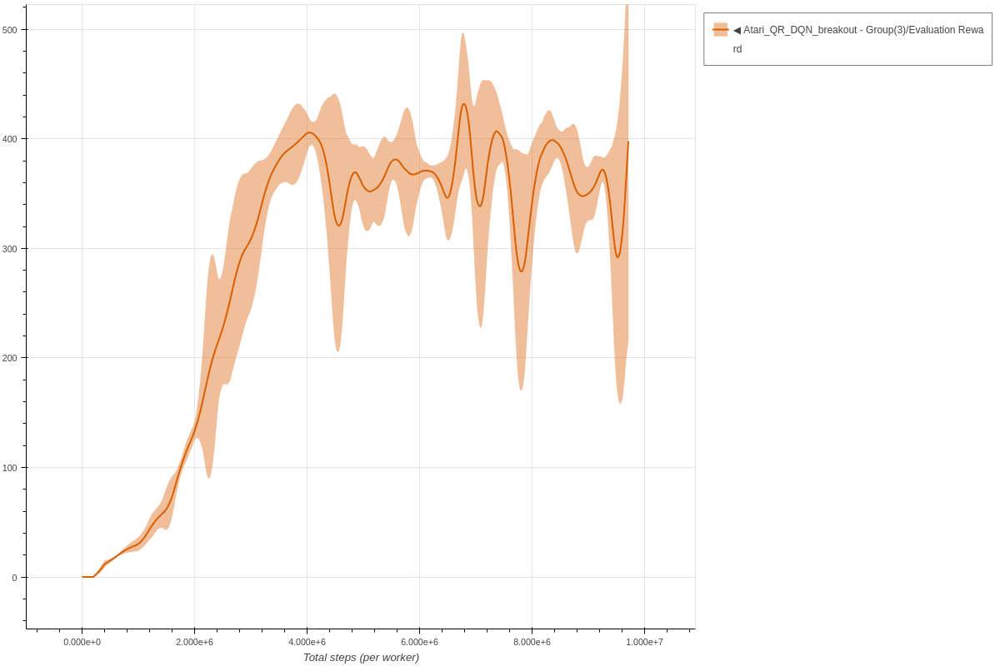
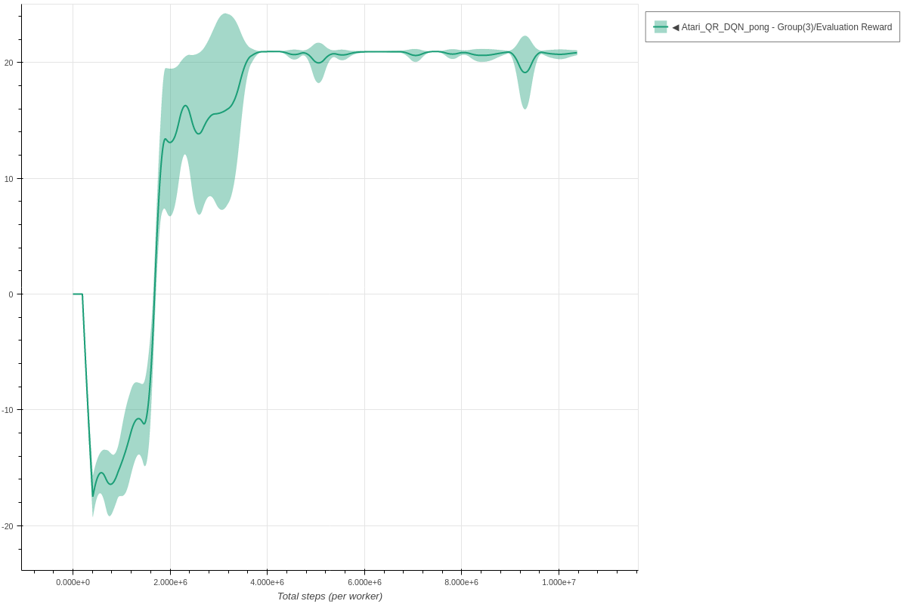

# Quantile Regression DQN

Each experiment uses 3 seeds and is trained for 10k environment steps.
The parameters used for QR-DQN are the same parameters as described in the [original paper](https://arxiv.org/abs/1710.10044.pdf).

### Breakout QR-DQN - single worker

```bash
coach -p Atari_QR_DQN -lvl breakout
```




### Pong QR-DQN - single worker

```bash
coach -p Atari_QR_DQN -lvl pong
```


