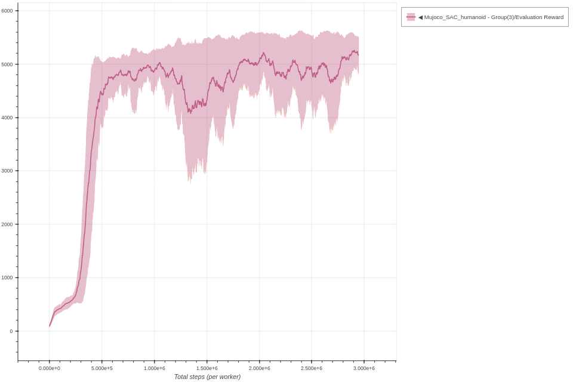

# Soft Actor Critic

Each experiment uses 3 seeds and is trained for 3M environment steps.
The parameters used for SAC are the same parameters as described in the [original paper](https://arxiv.org/abs/1801.01290).

### Inverted Pendulum SAC - single worker

```bash
coach -p Mujoco_SAC -lvl inverted_pendulum
```


### Hopper Clipped SAC - single worker

```bash
coach -p Mujoco_SAC -lvl hopper
```


### Half Cheetah Clipped SAC - single worker

```bash
coach -p Mujoco_SAC -lvl half_cheetah
```


### Walker 2D Clipped SAC - single worker

```bash
coach -p Mujoco_SAC -lvl walker2d
```


### Humanoid Clipped SAC - single worker

```bash
coach -p Mujoco_SAC -lvl humanoid
```


