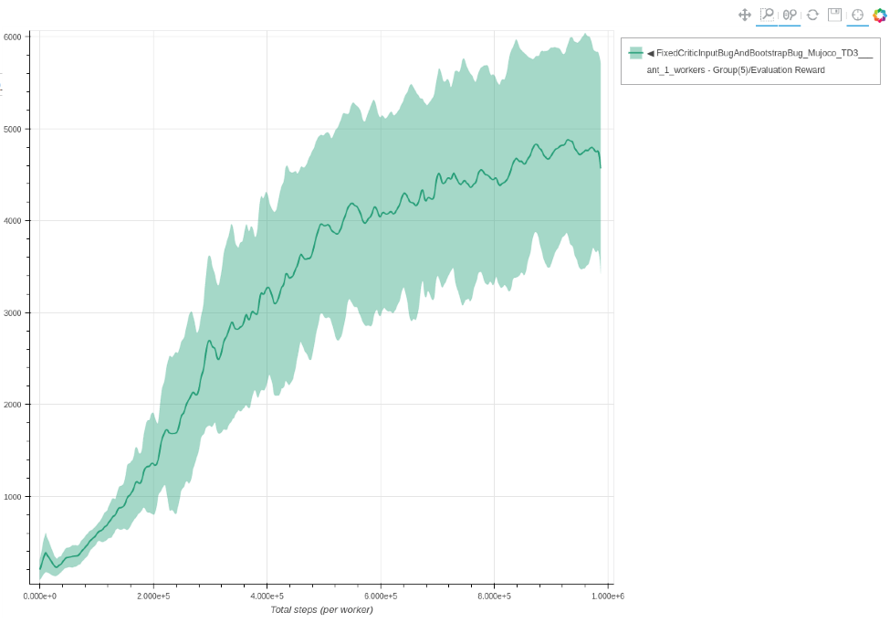

# Twin Delayed DDPG

Each experiment uses 5 seeds and is trained for 1M environment steps.
The parameters used for TD3 are the same parameters as described in the [original paper](https://arxiv.org/pdf/1802.09477.pdf), and [repository](https://github.com/sfujim/TD3). 

### Ant TD3 - single worker

```bash
coach -p Mujoco_TD3 -lvl ant
```




### Hopper TD3 - single worker

```bash
coach -p Mujoco_TD3 -lvl hopper
```


### Half Cheetah TD3 - single worker

```bash
coach -p Mujoco_TD3 -lvl half_cheetah
```


### Reacher TD3 - single worker

```bash
coach -p Mujoco_TD3 -lvl reacher
```


### Walker2D TD3 - single worker

```bash
coach -p Mujoco_TD3 -lvl walker2d
```


