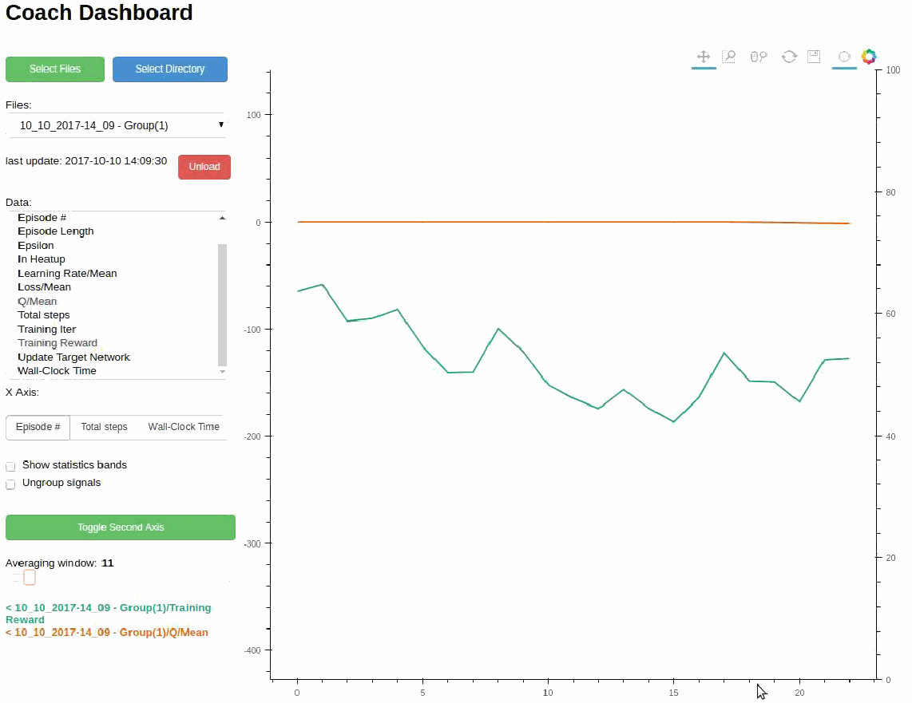
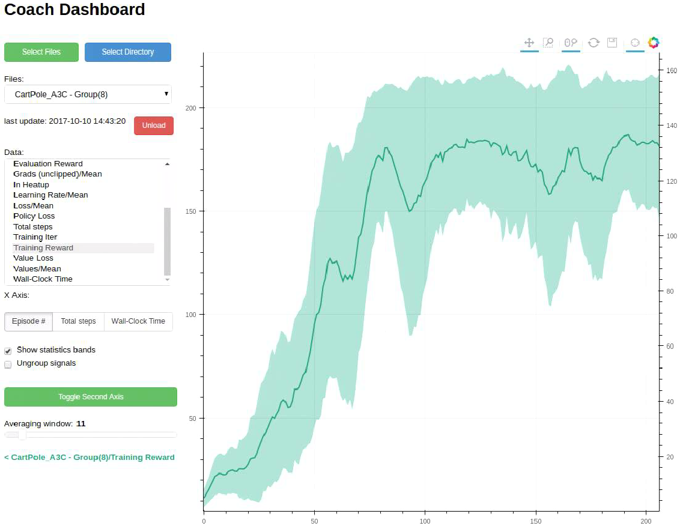
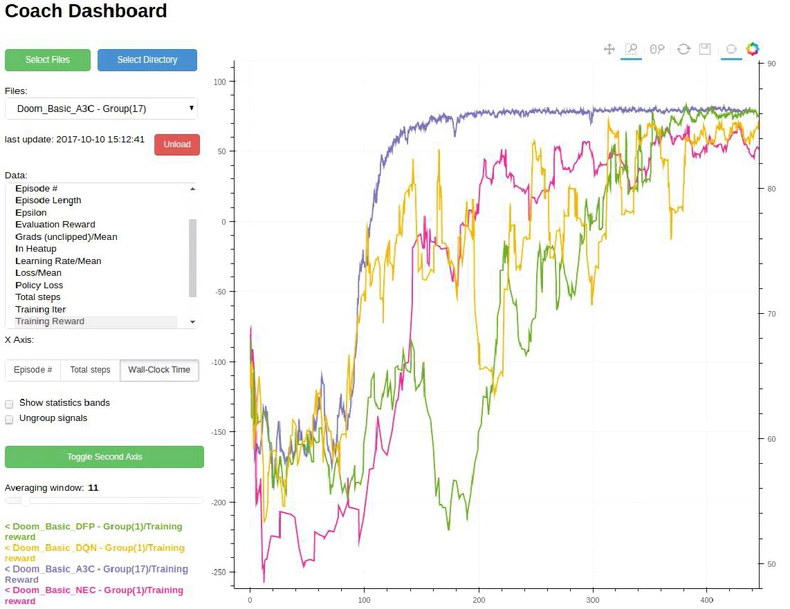

Reinforcement learning algorithms are neat. That is - when they work. But when they don't, RL algorithms are often quite tricky to debug. 

Finding the root cause for why things break in RL is rather difficult. Moreover, different RL algorithms shine in some aspects, but then lack on other. Comparing the algorithms faithfully is also a hard task, which requires the right tools.

Coach Dashboard is a visualization tool which simplifies the analysis of the training process. Each run of Coach extracts a lot of information from within the algorithm and stores it in the experiment directory. This information is very valuable for debugging, analyzing and comparing different algorithms. But without a good visualization tool, this information can not be utilized. This is where Coach Dashboard takes place.

### Visualizing Signals

Coach Dashboard exposes a convenient user interface for visualizing the training signals. The signals are dynamically updated - during the agent training. Additionaly, it allows selecting a subset of the available signals, and then overlaying them on top of each other.  

* Holding the CTRL key, while selecting signals, will allow visualizing more than one signal. 
* Signals can be visualized, using either of the Y-axes, in order to visualize signals with different scales. To move a signal to the second Y-axis, select it and press the 'Toggle Second Axis' button.

### Tracking Statistics

When running parallel algorithms, such as A3C, it often helps visualizing the learning of all the workers, at the same time. Coach Dashboard allows viewing multiple signals (and even smooth them out, if required) from multiple workers. In addition, it supports viewing the mean and standard deviation of the same signal, across different workers, using Bollinger bands.  

<table style="box-shadow: none;">
<tr>
<td style="width: 450px; text-align: center;">
	
	<b>Displaying Bollinger Bands</b>
</td>
<td style="width: 450px; text-align: center;">
	
	<b>Displaying All The Workers</b>
</td>
</tr>
</table>

### Comparing Runs

Reinforcement learning algorithms are notoriously known as unstable, and suffer from high run-to-run variance. This makes benchmarking and comparing different algorithms even harder. To ease this process, it is common to execute several runs of the same algorithm and average over them. This is easy to do with Coach Dashboard, by centralizing all the experiment directories in a single directory, and then loading them as a single group. Loading several groups of different algorithms then allows comparing the averaged signals, such as the total episode reward.  

In RL, there are several interesting performance metrics to consider, and this is easy to do by controlling the X-axis units in Coach Dashboard. It is possible to switch between several options such as the total number of steps or the total training time.

<table style="box-shadow: none;">
<tr>
<td style="width: 450px; text-align: center;">

<b>Comparing Several Algorithms According to the Time Passed</b>

</td>
<td style="width: 450px; text-align: center;">

<b>Comparing Several Algorithms According to the Number of Episodes Played</b>

</td>
</tr>
</table>

