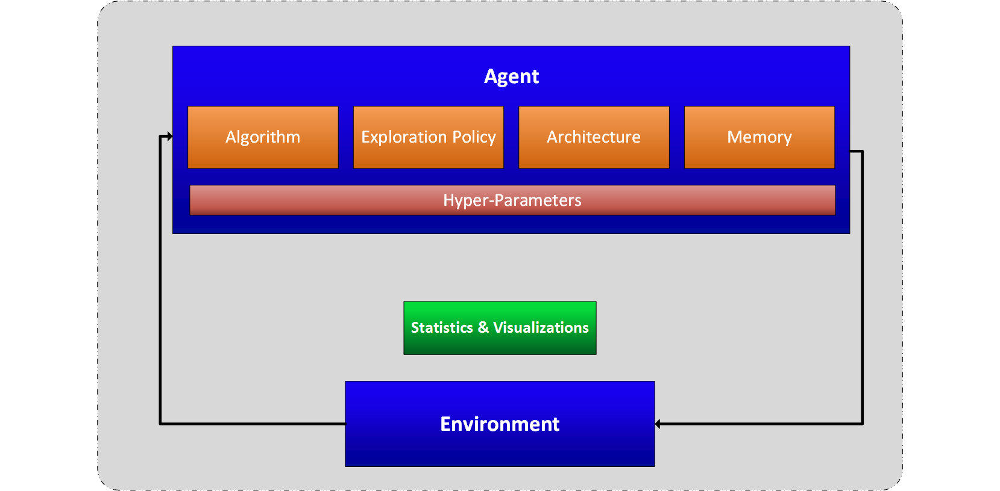

# What is Coach?

## Motivation

Enable easy design and training of state-of-the-art reinforcement learning algorithms with multiple environments

## Solution

Coach is a python environment which models the interaction between an agent and an environment in a modular way.
With Coach, it is possible to model an agent by combining various building blocks, and training the agent on multiple environments.
The available environments allow testing the agent in different practical fields such as robotics, autonomous driving, games and more. 
Coach collects statistics from the training process and supports advanced visualization techniques for debugging the agent being trained.

## Design

