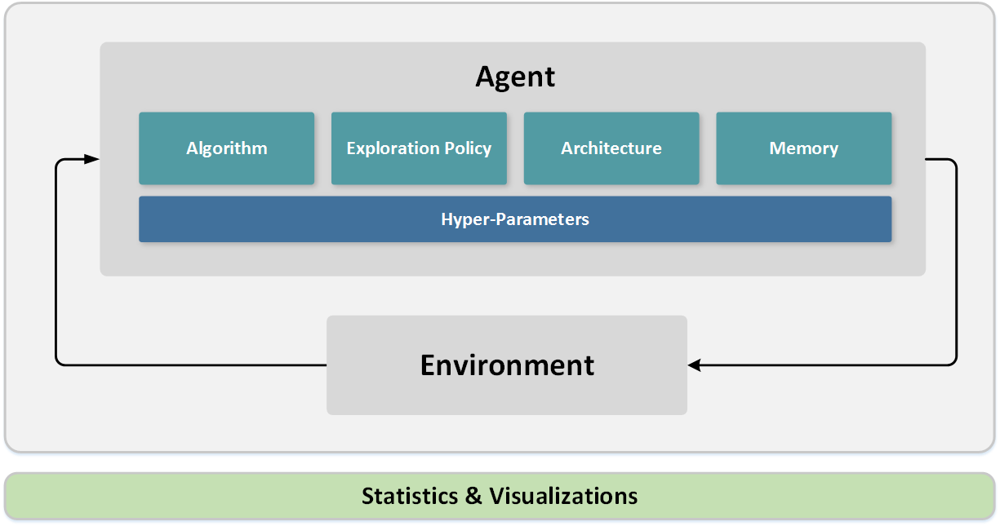

# What is Coach?

## Motivation

Train and evaluate reinforcement learning agents by harnessing the power of multi-core CPU processing to achieve state-of-the-art results. Provide a sandbox for easing the development process of new algorithms through a modular design and an elegant set of APIs. 

## Solution

Coach is a python environment which models the interaction between an agent and an environment in a modular way.
With Coach, it is possible to model an agent by combining various building blocks, and training the agent on multiple environments.
The available environments allow testing the agent in different practical fields such as robotics, autonomous driving, games and more. 
Coach collects statistics from the training process and supports advanced visualization techniques for debugging the agent being trained.

Blog post from the Intel® AI website can be found [here](https://ai.intel.com/reinforcement-learning-coach-intel/).

GitHub repository is [here](https://github.com/NervanaSystems/coach). 

## Design

