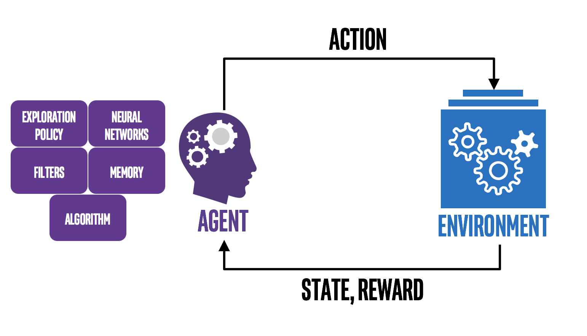

.. Reinforcement Learning Coach documentation master file, created by
   sphinx-quickstart on Sun Oct 28 15:35:09 2018.
   You can adapt this file completely to your liking, but it should at least
   contain the root `toctree` directive.

Reinforcement Learning Coach
============================

Coach is a python framework which models the interaction between an agent and an environment in a modular way.
With Coach, it is possible to model an agent by combining various building blocks, and training the agent on multiple environments.
The available environments allow testing the agent in different fields such as robotics, autonomous driving, games and more.
It exposes a set of easy-to-use APIs for experimenting with new RL algorithms, and allows simple integration of
new environments to solve.
Coach collects statistics from the training process and supports advanced visualization techniques for debugging the agent being trained.

Blog posts from the Intel® AI website:

* `Release 0.8.0 <https://ai.intel.com/reinforcement-learning-coach-intel/>`_ (initial release)

* `Release 0.9.0 <https://ai.intel.com/reinforcement-learning-coach-carla-qr-dqn/>`_

* `Release 0.10.0 <https://ai.intel.com/introducing-reinforcement-learning-coach-0-10-0/)>`_

* `Release 0.11.0 <https://ai.intel.com/>`_ (current release)

You can find more details in the `GitHub repository <https://github.com/NervanaSystems/coach>`_.

.. toctree::
   :maxdepth: 2
   :caption: Intro
   :titlesonly:

   usage
   dist_usage
   features/index
   selecting_an_algorithm
   dashboard

.. toctree::
   :maxdepth: 1
   :caption: Design

   design/control_flow
   design/network
   design/horizontal_scaling

.. toctree::
   :maxdepth: 1
   :caption: Contributing

   contributing/add_agent
   contributing/add_env

.. toctree::
   :maxdepth: 1
   :caption: Components

   components/agents/index
   components/architectures/index
   components/data_stores/index
   components/environments/index
   components/exploration_policies/index
   components/filters/index
   components/memories/index
   components/memory_backends/index
   components/orchestrators/index
   components/core_types
   components/spaces
   components/additional_parameters

